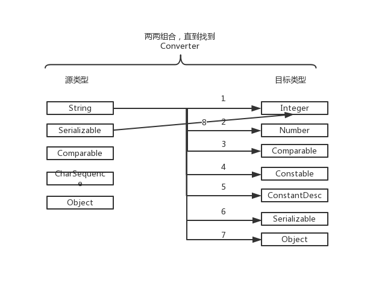

# BeanWrapper

## BeanWrapper是什么

Spring底层操作Java Bean的核心接口。

通常不直接使用该接口，而是通过`BeanFactory`或`DataBinder`。

提供分析和操作标准Java Bean的操作: 获取和设置属性值(单个或批量)、获取属性描述以及查询属性的可读性/可写性的能力。

此接口还支持嵌套属性，允许将子属性上的属性设置为无限深度。

`BeanWrapper`的`extractOldValueForEditor`默认值是`false`，可以避免调用 `getter`方法。将此选项设置为`true`，可以向自定义编辑器暴露当前属性值。

可以看出`BeanWrapper`是操作Java Bean 的强大利器。

## 类结构


BeanWrapper 继承自`TypeConverter`，`PropertyEditorRegistry`，`PropertyAccessor`, `ConfigurablePropertyAccessor`接口。从名称可以看出具备了类型转换，属性编辑器注册，属性访问及配置的功能。

## 使用方式

接下来看看如何使用BeanWrapper来操作我们的Java Bean。

Spring给我们提供了一个实现类`BeanWrapperImpl`，我们就用这个类来展示。

### 获取属性

Bean对象：

```java
public class Student {
    private String name;

    private String age;

    private ClassRoom classRoom;

    public String getName() {
        return name;
    }

    public void setName(String name) {
        this.name = name;
    }

    public String getAge() {
        return age;
    }

    public void setAge(String age) {
        this.age = age;
    }

    public ClassRoom getClassRoom() {
        return classRoom;
    }

    public void setClassRoom(ClassRoom classRoom) {
        this.classRoom = classRoom;
    }
}
```

定义了*3*个属性，看一下使用方法：

```java
Student student = new Student();
BeanWrapper wrapper = new BeanWrapperImpl(student);
System.out.println("展示bean 的属性");
Arrays.stream(wrapper.getPropertyDescriptors()).forEach(System.out::println);
```

结果如下：

```java
展示bean 的属性
org.springframework.beans.GenericTypeAwarePropertyDescriptor[name=age]
org.springframework.beans.GenericTypeAwarePropertyDescriptor[name=class]
org.springframework.beans.GenericTypeAwarePropertyDescriptor[name=classRoom]
org.springframework.beans.GenericTypeAwarePropertyDescriptor[name=name]
```

可以看出将有`get`方法的属性已经打印出来了。同时可以看到多打印了一个`class`属性，但是我们的类里面没有定义这个属性，`Object`类中有`getClass`的方法。我们大胆猜测Spring会遵循Java Bean的设计原则，通过`get`方法来获取属性。 

现在将`age`改成`age1`，`getAge`方法不变，看一下结果。

```java
展示bean 的属性
org.springframework.beans.GenericTypeAwarePropertyDescriptor[name=age]
org.springframework.beans.GenericTypeAwarePropertyDescriptor[name=class]
org.springframework.beans.GenericTypeAwarePropertyDescriptor[name=classRoom]
org.springframework.beans.GenericTypeAwarePropertyDescriptor[name=name]
```

打印出来的属性名一样。现在交换一下，将`getAge`改成`getAge1`，属性`age1`改成`age`。

```java
展示bean 的属性
org.springframework.beans.GenericTypeAwarePropertyDescriptor[name=age1]
org.springframework.beans.GenericTypeAwarePropertyDescriptor[name=class]
org.springframework.beans.GenericTypeAwarePropertyDescriptor[name=classRoom]
org.springframework.beans.GenericTypeAwarePropertyDescriptor[name=name]
```

可以看到获取到的属性已经变成了`age1`。这充分验证了我们的猜想。

我们可以看一下Spring的代码，里面使用了`java.beans`包下`Introspector`类来获取Bean的信息。

#### 嵌套属性

上面的结果中，我们并没有获取到ClassRoom的属性。BeanWrapper并不支持这种操作，我们可以扩展一下，比如判断属性，如果是自定义的类型，那么就再调用一次BeanWrapper的方法。这有个前提是这个属性不为`null`。

```java
Student student = new Student();
student.setClassRoom(new ClassRoom());
BeanWrapper wrapper = new BeanWrapperImpl(student);

System.out.println("展示bean 的属性");
Arrays.stream(wrapper.getPropertyDescriptors()).forEach(System.out::println);

System.out.println("展示bean 的嵌套属性");
wrapper = new PowerfulBeanWrapper(student);
Arrays.stream(wrapper.getPropertyDescriptors()).forEach(System.out::println);
```

先上结果：

```java
展示bean 的属性
org.springframework.beans.GenericTypeAwarePropertyDescriptor[name=age]
org.springframework.beans.GenericTypeAwarePropertyDescriptor[name=class]
org.springframework.beans.GenericTypeAwarePropertyDescriptor[name=classRoom]
org.springframework.beans.GenericTypeAwarePropertyDescriptor[name=name]
展示bean 的嵌套属性
org.springframework.beans.GenericTypeAwarePropertyDescriptor[name=age]
org.springframework.beans.GenericTypeAwarePropertyDescriptor[name=class]
org.springframework.beans.GenericTypeAwarePropertyDescriptor[name=classRoom]
org.springframework.beans.GenericTypeAwarePropertyDescriptor[name=name]
org.springframework.beans.GenericTypeAwarePropertyDescriptor[name=class]
org.springframework.beans.GenericTypeAwarePropertyDescriptor[name=name]
```

ClassRoom类只有一个name 属性，这里看到也打印出来了。证明思路是对的，只是这个结构还需要组织一下，现在是扁平的。

下面看一下`PowerfulBeanWrapper`的实现方式

```java
public class PowerfulBeanWrapper extends BeanWrapperImpl {
    public PowerfulBeanWrapper(Object o) {
        super(o);
    }

    @Override
    public PropertyDescriptor[] getPropertyDescriptors() {
        PropertyDescriptor[] propertyDescriptors = super.getPropertyDescriptors();
        List<PropertyDescriptor> propertyDescriptorList = new ArrayList<>(Arrays.asList(propertyDescriptors));
        Arrays.stream(propertyDescriptors).forEach(propertyDescriptor -> {
            Object value = getPropertyValue(propertyDescriptor.getName());
            if (value != null && !(value instanceof Class) && !value.getClass().isPrimitive()) {
                propertyDescriptorList.addAll(Arrays.asList(new BeanWrapperImpl(value).getPropertyDescriptors()));
            }
        });
        return propertyDescriptorList.toArray(new PropertyDescriptor[0]);
    }
}
```

直接继承自`BeanWrapperImpl`类，覆盖了`getPropertyDescriptors`方法。遍历属性值，如果不为空并且不是Class，则再获取一次这个属性的属性。这里只获取了2层属性，可以在获取嵌套属性时换成我们的`PowerfulBeanWrapper`类既可支持无限层。

### 获取属性值

可以使用BeanWrapper的`getPropertyValue`方法来获取属性值。上面的代码中已经展示过了。

支持获取嵌套属性：

```java
Student student = new Student();
ClassRoom classRoom = new ClassRoom();
classRoom.setName("room1");
student.setClassRoom(classRoom);
BeanWrapper wrapper = new BeanWrapperImpl(student);
System.out.println(wrapper.getPropertyValue("name"));
System.out.println(wrapper.getPropertyValue("classRoom.name"));
```

结果：

```java
null
room1
```

可以看出来还是很方便的。

**注： 当嵌套对象为空时，默认获取嵌套对象的属性会抛出异常。**  这时可以加一个设置：

 ```java
 wrapper.setAutoGrowNestedPaths(true);
 System.out.println("嵌套对象为空时：" + wrapper.getPropertyValue("classRoom.name"));
 ```

该属性的意义是自动扩展嵌套属性，按照默认值来初始化属性。此处就会将`classRoom`初始化，并且里面的属性为空。

```java
嵌套对象为空时：null
```

### 设置属性值

可以通过`setPropertyValue`方法来设置属性值。同上，当嵌套对象为空时，不能设置嵌套对象的属性，设置`wrapper.setAutoGrowNestedPaths(true)`即可。

注意以下代码：

```java
private String age;

wrapper.setPropertyValue("age",1);
```

在这里设置属性值的时候是整数型，但是`age`声明的时候是String。BeanWrapper是如何正确的赋值的呢？

`BeanWrapperImpl`内部会委托给`TypeConverterDelegate`类，先查找自定义`PropertyEditor`, 如果没有找到的话，则查找`ConversionService`，没有的话查找默认的`PropertyEditor`,再没有的话使用内部定义好的转换策略（按类型去判断，然后去转换）。

## PropertyEditor

`PropertyEditor`属于Java Bean规范里面的类，可以给GUI程序设置对象属性值提供方便，所以接口里有一些和GUI相关的方法，显然目前已经过时了。同时，官方文档上解释，它是线程不安全的。必须得有一个默认构造函数。可以想象一下，在界面上填入一个值，这个值一般来说都是`String`类型的，填入之后这个值能自动设置到对应的对象中（ 这里纯粹是我意淫的，对`awt`并不是很熟，不知道是不是这样）。了解安卓编程的朋友可能知道，我们要取界面上填的值，通常要拿到界面元素，然后再拿到值，然后再设置到对象中去。当界面上有很多个输入控件时，这样繁琐的操作，简直要人命。所以安卓后来出了数据绑定。这里有一篇[文章](https://www.iteye.com/blog/stamen-1525668)讲得很好。

BeanWrapperImpl内置了一些 `PropertyEditor`。

```java
private void createDefaultEditors() {
		this.defaultEditors = new HashMap<>(64);

		// Simple editors, without parameterization capabilities.
		// The JDK does not contain a default editor for any of these target types.
		this.defaultEditors.put(Charset.class, new CharsetEditor());
		this.defaultEditors.put(Class.class, new ClassEditor());
		this.defaultEditors.put(Class[].class, new ClassArrayEditor());
		this.defaultEditors.put(Currency.class, new CurrencyEditor());
		this.defaultEditors.put(File.class, new FileEditor());
		this.defaultEditors.put(InputStream.class, new InputStreamEditor());
		this.defaultEditors.put(InputSource.class, new InputSourceEditor());
		this.defaultEditors.put(Locale.class, new LocaleEditor());
		this.defaultEditors.put(Path.class, new PathEditor());
		this.defaultEditors.put(Pattern.class, new PatternEditor());
		this.defaultEditors.put(Properties.class, new PropertiesEditor());
		this.defaultEditors.put(Reader.class, new ReaderEditor());
		this.defaultEditors.put(Resource[].class, new ResourceArrayPropertyEditor());
		this.defaultEditors.put(TimeZone.class, new TimeZoneEditor());
		this.defaultEditors.put(URI.class, new URIEditor());
		this.defaultEditors.put(URL.class, new URLEditor());
		this.defaultEditors.put(UUID.class, new UUIDEditor());
		this.defaultEditors.put(ZoneId.class, new ZoneIdEditor());

		// Default instances of collection editors.
		// Can be overridden by registering custom instances of those as custom editors.
		this.defaultEditors.put(Collection.class, new CustomCollectionEditor(Collection.class));
		this.defaultEditors.put(Set.class, new CustomCollectionEditor(Set.class));
		this.defaultEditors.put(SortedSet.class, new CustomCollectionEditor(SortedSet.class));
		this.defaultEditors.put(List.class, new CustomCollectionEditor(List.class));
		this.defaultEditors.put(SortedMap.class, new CustomMapEditor(SortedMap.class));

		// Default editors for primitive arrays.
		this.defaultEditors.put(byte[].class, new ByteArrayPropertyEditor());
		this.defaultEditors.put(char[].class, new CharArrayPropertyEditor());

		// The JDK does not contain a default editor for char!
		this.defaultEditors.put(char.class, new CharacterEditor(false));
		this.defaultEditors.put(Character.class, new CharacterEditor(true));

		// Spring's CustomBooleanEditor accepts more flag values than the JDK's default editor.
		this.defaultEditors.put(boolean.class, new CustomBooleanEditor(false));
		this.defaultEditors.put(Boolean.class, new CustomBooleanEditor(true));

		// The JDK does not contain default editors for number wrapper types!
		// Override JDK primitive number editors with our own CustomNumberEditor.
		this.defaultEditors.put(byte.class, new CustomNumberEditor(Byte.class, false));
		this.defaultEditors.put(Byte.class, new CustomNumberEditor(Byte.class, true));
		this.defaultEditors.put(short.class, new CustomNumberEditor(Short.class, false));
		this.defaultEditors.put(Short.class, new CustomNumberEditor(Short.class, true));
		this.defaultEditors.put(int.class, new CustomNumberEditor(Integer.class, false));
		this.defaultEditors.put(Integer.class, new CustomNumberEditor(Integer.class, true));
		this.defaultEditors.put(long.class, new CustomNumberEditor(Long.class, false));
		this.defaultEditors.put(Long.class, new CustomNumberEditor(Long.class, true));
		this.defaultEditors.put(float.class, new CustomNumberEditor(Float.class, false));
		this.defaultEditors.put(Float.class, new CustomNumberEditor(Float.class, true));
		this.defaultEditors.put(double.class, new CustomNumberEditor(Double.class, false));
		this.defaultEditors.put(Double.class, new CustomNumberEditor(Double.class, true));
		this.defaultEditors.put(BigDecimal.class, new CustomNumberEditor(BigDecimal.class, true));
		this.defaultEditors.put(BigInteger.class, new CustomNumberEditor(BigInteger.class, true));

		// Only register config value editors if explicitly requested.
		if (this.configValueEditorsActive) {
			StringArrayPropertyEditor sae = new StringArrayPropertyEditor();
			this.defaultEditors.put(String[].class, sae);
			this.defaultEditors.put(short[].class, sae);
			this.defaultEditors.put(int[].class, sae);
			this.defaultEditors.put(long[].class, sae);
		}
	}
```

这里没有注册`String`, 所以走的是内置方案，直接调用`toString`方法

```java
if (String.class == requiredType && ClassUtils.isPrimitiveOrWrapper(convertedValue.getClass())) {
  // We can stringify any primitive value...
  return (T) convertedValue.toString();
}
```

### 自定义`PropertyEditor`

当Spring提供的`PropertyEditor`无法满足我们的需求时，我们可以自定义`PropertyEditor`。

一般不直接实现接口，而是继承`PropertyEditorSupport`类。Spring中大多数场景都是将传入的字符串转换成对应的属性值，需要重写`setAsText`方法。

```java
/**
 * 转换String -> ClassRoom;
 */
public class ClassRoomPropertyEditor extends PropertyEditorSupport {
    @Override
    public void setAsText(String text) throws IllegalArgumentException {
        //将逗号分隔的值转换成对象的属性值：room3,3
        String[] strings = Optional.ofNullable(text).orElseGet(String::new).split(",");
        ClassRoom classRoom = new ClassRoom();
        classRoom.setName(strings[0]);
        classRoom.setSize(Integer.parseInt(strings[1]));
        setValue(classRoom);
    }
}
```

上面的代码中，将字符串进行分隔，第一个值作为`ClassRoom`的`name`值，第二个值作为`size`。如何使用这个`PropertyEditor`?

先注册这个类，再设置`Student`的`classRoom`属性：

```java
wrapper = new BeanWrapperImpl(student);
//注解自定义PropertyEditor
wrapper.registerCustomEditor(ClassRoom.class, new ClassRoomPropertyEditor());
wrapper.setPropertyValue("classRoom", "room3,3");
```

这样就给`Student`类的`classRoom`属性进行了初始化。

## `ConversionService`

`ConversionService`是Spring提供的一套通用的类型转换机制的入口，相比`PropertyEditor`来说：

1. 支持的类型转换范围更广。
2. 支持从父类型转换为子类型，即多态。
3. 省去了Java GUI相关的概念。
4. 线程安全。

### 方法

- `boolean canConvert(@Nullable Class<?> sourceType, Class<?> targetType)`：如果可以将`sourceType`对象转换为`targetType`，则返回`true`。

  如果此方法返回`true`，则意味着`convert(Object, Class)`方法能够将`sourceType`实例转换为`targetType`。

  关于集合、数组和Map类型需要特别注意：**对于集合、数组和Map类型之间的转换，此方法将返回true，即使在底层元素不可转换的情况下，转换过程仍然可能生成一个`ConversionException`。在处理集合和映射时，调用者需要处理这种特殊情况。**

- `boolean canConvert(@Nullable TypeDescriptor sourceType, TypeDescriptor targetType)`：如果可以将`sourceType`对象转换为`targetType`，则返回`true`。`TypeDescriptor `提供关于将要发生转换的源和目标位置的附加上下文信息，通常是对象字段或属性的位置。

  如果此方法返回`true`，则意味着`convert(Object、TypeDescriptor、TypeDescriptor)`能够将`sourceType`实例转换为`targetType`。

  关于集合、数组和Map类型需要特别注意：**对于集合、数组和Map类型之间的转换，此方法将返回true，即使在底层元素不可转换的情况下，转换过程仍然可能生成一个`ConversionException`。在处理集合和映射时，调用者需要处理这种特殊情况。**

- `<T> T convert(@Nullable Object source, Class<T> targetType)`：将给定的对象转换为指定的`targetType`类型对象。

- `Object convert(@Nullable Object source, @Nullable TypeDescriptor sourceType, TypeDescriptor targetType)`：将给定的对象转换为指定的`targetType`类型对象。`TypeDescriptor `提供关于将要发生转换的源和目标位置的附加上下文信息，通常是对象字段或属性位置。

## `Converter`

`Converter`是具体的某类转换器接口，负责将某个类型的对象转成另外一个类型的对象。并且是一个函数式接口。

就提供了一个转换方法：

- `T convert(S source)`：转换对象类型。

## `ConverterFactory`

生产一种`Converter`，这种`Converter`可以将对象从`S`转换为`R`的子类型。也就是说支持多态功能。
实现类还可以实现`ConditionalConverter`接口。

- `<T extends R> Converter<S, T> getConverter(Class<T> targetType)`：根据目标类型`T`获取`Converter`，该`Converter`将源类型`S`转换成`R`的子类型`T`。

## `ConditionalConverter`

该接口可以根据源和目标`TypeDescriptor`的属性选择性地执行`Converter`、`GenericConverter`或`ConverterFactory`。

通常用于根据字段或类特征(如注解或方法)的存在选择性地匹配自定义转换逻辑。例如，当从`String`字段转换为`Date`字段时，如果目标字段还有`@DateTimeFormat`注解，则实现类`matches`方法可能返回`true`，也就是说如果目标字段上没有`@DateTimeFormat`注解，那么可能不会应用该转换，该接口可以控制需不需要转换。

另外一个例子，当从字符串字段转换为`Account`字段时，如果目标`Account`类定义了公共静态`findAccount(String)`方法，则实现类`matches`方法可能返回`true`。

- `boolean matches(TypeDescriptor sourceType, TypeDescriptor targetType)`：是否需要转换。

## `GenericConverter`

这是最灵活的转换器SPI接口，也是最复杂的。它的灵活性在于`GenericConverter`可以支持多个源/目标类型对之间的转换(参见`getConvertibleTypes()`方法)。此外，`GenericConverter`实现类在类型转换过程中可以访问源/目标字段上下文，允许解析源和目标字段元数据，如注解和泛型信息，这些信息可用于复杂转换逻辑。

当比较简单的`Converter`或`ConverterFactory`接口够用时，通常不应使用此接口。
实现类还可以实现`ConditionalConverter`接口。

- Set<ConvertiblePair> getConvertibleTypes()：返回此`Converter`可以在源类型和目标类型之间转换的类型。
  Set中每条都是一个可转换的源到目标类型对。`ConvertiblePair`保存源类型与目标类型的映射关系。
  对于`ConditionalConverter`，此方法可能返回`null`，意味着该`GenericConverter`适用于所有源与目标类型对。未实现`ConditionalConverter`接口的实现类，此方法不能返回`null`。

## `ConverterRegistry`

用来注册`Converter`。

## `ConversionService`组件结构


`ConversionService`提供转换功能的统一入口，`ConverterRegistry`提供`Converter`注册功能，将`Converter`集中起来，转换时从中查出对应的`Converter`。`Converter`负责具体的转换过程。`ConfigurableConversionService`继承自`ConversionService`和`ConverterRegistry`，集成转换和注册功能。

下面看一下具体的实现类。

## `GenericConversionService`类

基础转换服务实现，适用于大部分情况。直接实现`ConfigurableConversionService`接口，实现了注册与转换功能。在注册`Converter`、`ConverterFactory`时，会将其转换成`GenericConverter`。

## `DefaultConversionService`类

继承自`GenericConversionService`，配置了适合大多数环境的`Converter`。
该类使用时可以直接实例化，暴露出静态方法`addDefaultConverters(ConverterRegistry)`，用于对某个`ConverterRegistry`实例进行特殊处理，也就是说当某个`ConverterRegistry`需要增加一个默认的`Converter`时，可以调用这个方法。

这里我们可以直接使用`DefaultConversionService`类，Spring已经配置了一些`Converter`。

```java
student = new Student();
wrapper = new BeanWrapperImpl(student);
wrapper.setAutoGrowNestedPaths(true);
//注册ConversionService
wrapper.setConversionService(new DefaultConversionService());
wrapper.setPropertyValue("classRoom.size", "3");
System.out.println("ConversionService, 设置嵌套对象的属性 size：" + wrapper.getPropertyValue("classRoom.size"));
//这里将字符串转换成数字
```

## Spring 提供的`Converter`

在Spring 的`org.springframework.core.convert.support`包中内置了一些转换器，提供数组、集合、字符串、数字、枚举、对象、Map、Boolean等之间的转换功能。

|                   | Array                        | Collection                        | Stream                  | ByteBuffer        | String(Character)             | Number(Integer)                  | Object                        | Enum                            | Map                 |Boolean |Charset |Currency |Locale |Properties |TimeZone |UUID |Calendar |
| ----------------- | ---------------------------- | --------------------------------- | ----------------------------- | -------------------------------- | ----------------------------- | ------------------------------- | ------------------- |------------------- | ----------------- | ----------------- | ----------------- | ----------------- | ----------------- | ----------------- | ----------------- | ----------------- | ----------------- |
| Array             | `ArrayToArrayConverter`      | `ArrayToCollectionConverter`      | `StreamConverter` | `ByteBufferConverter` | `ArrayToStringConverter`      |                                  | `ArrayToObjectConverter`      |                                 |                     |||||||||
| Collection        | `CollectionToArrayConverter` | `CollectionToCollectionConverter` | `StreamConverter` |  | `CollectionToStringConverter` |                                  | `CollectionToObjectConverter` |                                 |                     |||||||||
| Stream | `StreamConverter` | `StreamConverter` |  |  |  | |  | | |||||||||
| String(Character) | `StringToArrayConverter`     | `StringToCollectionConverter` |  |  | `StringToCharacterConverter` | `StringToNumberConverterFactory` |                               | `StringToEnumConverterFactory` |                     |`StringToBooleanConverter`|`StringToCharsetConverter`|`StringToCurrencyConverter`|`StringToLocaleConverter`|`StringToPropertiesConverter`|`StringToTimeZoneConverter`|`StringToUUIDConverter`||
| ByteBuffer | `ByteBufferConverter` |  |  |  |  |  | `ByteBufferConverter` |  | |||||||||
| Number(Integer)   |                              |                                   |                                   |                                   | `NumberToCharacterConverter`  | `NumberToNumberConverterFactory` |                               | `IntegerToEnumConverterFactory` |                     |||||||||
| Object            | `ObjectToArrayConverter`     | `ObjectToCollectionConverter`     |      | `ByteBufferConverter` | `ObjectToStringConverter`     |                                  | `ObjectToObjectConverter`,`IdToEntityConverter` |                                 |                     |||||||||
| Enum              |                              |                                   |                                   |                                   | `EnumToStringConverter`       | `EnumToIntegerConverter`         |                               |                                 |                     |||||||||
| Map               |                              |                                   |                                   |                                   |                               |                                  |                               |                                 | `MapToMapConverter` |||||||||
| Boolean | | | | | | | | |  |||||||||
| Properties | | | | | `PropertiesToStringConverter` | | | |  |||||||||
| ZoneId | | | | |  | | | |  ||||||`ZoneIdToTimeZoneConverter`|||
| ZonedDateTime | | | | |  | | | |  ||||||||`ZonedDateTimeToCalendarConverter`|

### `StringToBooleanConverter`

将`String`转换成`Boolean`。`true`、`on、yes、1` 转换成`Boolean.TRUE`。`false、off` 、no` 、`0 `转换成`Boolean.FALSE`。

```java
wrapper.setPropertyValue("good", "1");
System.out.println("ConversionService, 设置bool值。 good：" + wrapper.getPropertyValue("good"));

//-------
//输出：
//ConversionService, 设置bool值。 good：true
```


## 自定义`Converter`

当Spring提供的转换器无法满足我们需要时，我们可以自定义转换逻辑。

上面提到的`Converter`、`GenericConverter`和`ConverterFactory`三个接口都可以用来实现转换逻辑。该如何选择？

- `Converter`：单值。从`S`->`T`。一对一转换。

- `ConverterFactory`：从`S` -> `T extends R`。一对多转换。 

- `GenericConverter` ：功能最复杂。实现多个类型对的转换。多对多转换。

在自定义`PropertyEditor`示例中，我们实现了从`String`转换到`ClassRoom`的功能。在这里通过`Converter`来实现此功能。

1. `StringToClassRoomConverter实现`String`转换到`ClassRoom`的功能。

   ```java
   public class StringToClassRoomConverter implements Converter<String, ClassRoom> {
       @Override
       public ClassRoom convert(String source) {
           String[] strings = Optional.ofNullable(source).orElseGet(String::new).split(",");
           ClassRoom classRoom = new ClassRoom();
           classRoom.setName(strings[0]);
           classRoom.setSize(Integer.parseInt(strings[1]));
           return classRoom;
       }
   }
   ```

2. 将此`StringToClassRoomConverter`注册到我们使用的`ConversionService`中。

   ```java
   DefaultConversionService conversionService = new DefaultConversionService();
   conversionService.addConverter(new StringToClassRoomConverter());
   wrapper.setConversionService(conversionService);
   ```

3. `BeanWrapper`使用此`ConversionService`设置Bean属性。这里不一定用`BeanWrapper` 来操作，可以直接调用`ConversionService`来转换。

   ```java
   wrapper.setPropertyValue("classRoom", "room4,4");
   System.out.println("自定义Converter, 设置嵌套对象的属性 name：" + wrapper.getPropertyValue("classRoom.name"));
   System.out.println("自定义Converter, 设置嵌套对象的属性 size：" + wrapper.getPropertyValue("classRoom.size"));
   
   //---------
   //自定义Converter, 设置嵌套对象的属性 name：room4
   //自定义Converter, 设置嵌套对象的属性 size：4
   ```

   从输出结果来看，已经成功转换成功。

当我们想从一个类型转换成某些类型时，可以实现`ConverterFactory`接口，因为我们也不知道总共有哪些类型，不可能每个类型都写一个`ConverterFactory`。比如说从`String`转换成枚举类型，前端传枚举类型的字面值，转换成具体的枚举类型。Spring 内置了`StringToEnumConverterFactory`来实现此功能。直接调用Enum的静态方法`Enum.valueOf(this.enumType, source.trim())`来实现转换。同理还有`IntegerToEnumConverterFactory`通过枚举的序号来转换。

当我们遇到容器型的转换需求时，因为容器内部保存的类型可能是多种多样的，比如说List里面既有String，也有int，我们要统一转成Long型。

```java
DefaultConversionService conversionService = new DefaultConversionService();
List source = new ArrayList();
source.add("1");
source.add(2);
//这里要注意初始化成内部类，才能正确获取泛型，不然不会转换。因为这个例子中，如果不写成内部类，源类型和目标类型其实是一致的，CollectionToCollectionConverter（这个转换器支持集合之间的转换） 内部不会去做转换。
List<Long> longList = new ArrayList<>(){};
for (Object s : source) {
    System.out.println(s.getClass() + " , " + s);
}
List convert = conversionService.convert(source, longList.getClass());
for (Object s : convert) {
    System.out.println(s.getClass() + " , " + s);
}

//-----------------
//不是内部类，不转换
//class java.lang.String , 1
//class java.lang.Integer , 2
//class java.lang.String , 1
//class java.lang.Integer , 2

//-------------
//正确转换
//class java.lang.String , 1
//class java.lang.Integer , 2
//class java.lang.Long , 1
//class java.lang.Long , 2
```


如果有多个`Converter`可以处理同一个转换需求，那么则看注意的先后顺序了，会取第一个符合条件的转换器。这里可以优化一下。

## `Formatter`

在前后端交互时，通常会遇到日期格式这样的问题，`Converter`虽然说也能解决这个问题，在转换时获取到正确的格式然后进行转换。但是这样无法灵活控制我们的格式，我们得把所有格式都写在我们的`Converter`里，换一种格式，又得改一次这个类。这时候`Formatter`接口出现了。

`Formatter`接口位于`context`包中。

先看一下`Formatter`类，从`Parser`和`Printer`接口继承而来，实现了`String` <-> `Object`转换的功能。


## `FormatterRegistry`

继承自`ConverterRegistry`接口，用来注册`Formatter`。

- `void addFormatter(Formatter<?> formatter)`：向特定类型的字段添加`Formatter`。字段类型由`Formatter`的泛型提供。

- `void addFormatterForFieldType(Class<?> fieldType, Formatter<?> formatter)`：向给定类型的字段添加`Formatter`。

  在打印时，如果声明了`Formatter`的类型`T`，并且不能将`fieldType`赋值给`T`，则在打印字段值的任务委托给`Formatter`之前，将尝试强制转换为`T`。在解析时，如果`Formatter`返回的已解析对象不能分配给运行时字段类型，则在返回已解析字段值之前，将尝试强制转换为`fieldType`。例如，`DateFormatter`声明的泛型为`Date`，如果这里的`fieldType`为`DateTime`（假设存在），如果`DateTime`可以用`Date`变量接收，则意味着可以分配给`Date`，也就不需要转换。否则则需要转换为`Date`类型。具体能否分配，可以查看该方法：`org.springframework.core.convert.TypeDescriptor#isAssignableTo`。

- `void addFormatterForFieldType(Class<?> fieldType, Printer<?> printer, Parser<?> parser)`：添加`Printer`/`Parser`对来格式化特定类型的字段，formatter 将委托给指定的`Printer`进行打印，并委托指定的`Parser`进行解析。

  在打印时，如果声明了`Printer`的类型`T`，并且`fieldType`不能赋值给`T`，则在委托`Printer`打印字段值之前，将尝试转换化类型`T`。在解析时，如果`Parser`返回的对象不能分配给`fieldType`，则在返回解析后的字段值之前，将尝试转换为`fieldType`。这个方法与上一个方法的区别就是将`Formatter`拆开。

- `void addFormatterForFieldAnnotation(AnnotationFormatterFactory<? extends Annotation> annotationFormatterFactory)`：为格式化注解标注的字段添加`Formatter`。此方法与上述方法的区别是不再以类型作为转换的依据了，而是根据注解来转换。比如某个字段上使用了`DateTimeFormat`注解，那会调用对应的`Formatter`。

## `FormattingConversionService`

`FormattingConversionService`类是Spring提供的支持`Formatter`接口的实现类，继承自`GenericConversionService`类，实现了`FormatterRegistry`和`EmbeddedValueResolverAware`接口，在`GenericConversionService`类的基础上增加了注册`Formatter`的功能。`EmbeddedValueResolverAware`接口用来解决字符串占位符、国际化等问题。注册`Formatter`时，会将`Formatter`转换成`GenericConverter`，调用此`GenericConverter`的`convert`方法时，将会调用`Formatter`的`print`或`parse`方法，由此可以看出我们需要格式化时，还是调用`FormattingConversionService`的`convert`方法即可。

## `DefaultFormattingConversionService`

Spring 内部提供了一些`Formatter`，会通过`DefaultFormattingConversionService`注册，我们无不特殊要求，可以直接使用此类，再在此基础上注册我们自定义的`Formatter`。

### Spring提供的`Formatter`

| `Formatter`或`FormatterRegistrar`              | `DefaultFormattingConversionService`是否注册 | 说明                                                         |
| ---------------------------------------------- | -------------------------------------------- | ------------------------------------------------------------ |
| `NumberFormatAnnotationFormatterFactory`       | Y                                            | 用于支持`@NumberFormat`注解                                  |
| `CurrencyUnitFormatter`                        | JSR-354相关的jar包出现在classpath时注册      | `javax.money.CurrencyUnit`                                   |
| `MonetaryAmountFormatter`                      | JSR-354相关的jar包出现在classpath时注册      | `javax.money.MonetaryAmount`                                 |
| `Jsr354NumberFormatAnnotationFormatterFactory` | JSR-354相关的jar包出现在classpath时注册      | `@NumberFormat`注解                                          |
| `DateTimeFormatterRegistrar`                   |                                              | 用来注册`JSR-310`新版日期和时间相关                          |
| `JodaTimeFormatterRegistrar`                   |                                              | 如果使用了`Joda`包，则会注册相关的``                         |
| `DateFormatterRegistrar`                       |                                              | 注册`@DateTimeFormat`注解的`AnnotationFormatterFactory`用于`Date`，`Calendar`，`Long`之间格式化以及`Date`，`Calendar`，`Long`之间的转换的`Converter`。默认不会注册用于直接转换的`DateFormatter`，不需要`@DateTimeFormat`注解，我们可以手动注册。 |


## 使用示例

1. 以日期为例，如果不用注解的话，我们需要手动注册一下`Formatter`。

```java
DefaultFormattingConversionService conversionService = new DefaultFormattingConversionService();
conversionService.addFormatter(new DateFormatter());
Date date = new Date();
System.out.println(conversionService.convert(date, String.class));

//----------------
// 2019年9月3日
```

`DateFormatter`还支持指定格式。可以通过构造函数传入。

```java
conversionService.addFormatter(new DateFormatter("yyyy-MM-dd"));

//-------
// 2019-09-03
```

2. 还是以日期为例，使用Spring提供的`@DateTimeFormat`注解。

   先创建一个类，里面有个日期字段使用`@DateTimeFormat`注解。

   ```java
   class Question {
       @DateTimeFormat(pattern = "yyyy-MM-dd")
       private Date createTime;
   ```

   指定格式为`yyyy-MM-dd`，这里我们借助`BeanWrapper`来触发格式化的动作。

   ```java
   DefaultFormattingConversionService conversionService = new DefaultFormattingConversionService();
   
   Question question = new Question();
   BeanWrapper beanWrapper = PropertyAccessorFactory.forBeanPropertyAccess(question);
   beanWrapper.setConversionService(conversionService);
   beanWrapper.setPropertyValue("createTime", "2019-09-03");
   System.out.println(question.getCreateTime());
   
   //-----------
   // Tue Sep 03 00:00:00 CST 2019
   
   // 将时间格式化 字符串
   System.out.println("注解格式化日期：" + conversionService.convert(question.getCreateTime(), new TypeDescriptor(question.getClass().getDeclaredField("createTime")), TypeDescriptor.valueOf(String.class)));
   
   //---------
   //注解格式化日期：2019-09-03
   ```
   
   通过打印的信息，可以看到已经成功将字符串`parse`为`Date`，并将日期`format`为字符串。由于注解在字段上，我们只提供了`Date`的值，所以还需要通过`TypeDescriptor`将字段的附加信息传递进去，这样才能正确识别到字段上的注解。

## 自定义`Formatter`

除了Spring 给我们提供的这些`Formatter`之外，我们还可以自定义来实现特殊功能。

比如前台传过来一段字符串，我们根据正则表达式截取部分字符。

### 定义`StringFormat`注解

此注解用来标注该字段需要用我们的自定义逻辑。可以指定具体的正则表达式。

```java
@Retention(RetentionPolicy.RUNTIME)
@Target({ ElementType.METHOD, ElementType.FIELD, ElementType.PARAMETER, ElementType.ANNOTATION_TYPE})
public @interface StringFormat {
    String pattern();
}
```


### 定义`StringFormatAnnotationFormatterFactory`

此类实现`AnnotationFormatterFactory`接口，规定`StringFormat`注解支持的字段类型。我们使用正则分隔字符串，那么可能得到多个目标串，所以`getFieldTypes`返回`List`来接收目标类型。`getParser`方法返回我们的自定义`StringFormatFormatter`。

```java
/**
     * The types of fields that may be annotated with the &lt;A&gt; annotation.
     */
    @Override
    public Set<Class<?>> getFieldTypes() {
        return Set.of(List.class, String.class);
    }

    /**
     * Get the Printer to print the value of a field of {@code fieldType} annotated with
     * {@code annotation}.
     * <p>If the type T the printer accepts is not assignable to {@code fieldType}, a
     * coercion from {@code fieldType} to T will be attempted before the Printer is invoked.
     *
     * @param annotation the annotation instance
     * @param fieldType  the type of field that was annotated
     * @return the printer
     */
    @Override
    public Printer<?> getPrinter(StringFormat annotation, Class<?> fieldType) {
        return new StringFormatFormatter(annotation.pattern());
    }

    /**
     * Get the Parser to parse a submitted value for a field of {@code fieldType}
     * annotated with {@code annotation}.
     * <p>If the object the parser returns is not assignable to {@code fieldType},
     * a coercion to {@code fieldType} will be attempted before the field is set.
     *
     * @param annotation the annotation instance
     * @param fieldType  the type of field that was annotated
     * @return the parser
     */
    @Override
    public Parser<?> getParser(StringFormat annotation, Class<?> fieldType) {
        return new StringFormatFormatter(annotation.pattern());
    }
```

### 自定义 `StringFormatFormatter`

该类实现`Formatter`。用来负责具体的解析逻辑。该类需要使用到注解中定义的正则表达式，这样我们就可以灵活控制每个字段的转换规则了。

```java
private static class StringFormatFormatter implements Formatter<Collection> {
        private Pattern pattern;
         StringFormatFormatter(String pattern) {
            this.pattern = Pattern.compile(pattern);
        }

        /**
         * Parse a text String to produce a T.
         *
         * @param text   the text string
         * @param locale the current user locale
         * @return an instance of T
         * @throws ParseException           when a parse exception occurs in a java.text parsing library
         * @throws IllegalArgumentException when a parse exception occurs
         */
        @Override
        public Collection parse(String text, Locale locale) throws ParseException {
            List<String> list = new ArrayList<>();
            Matcher matcher = pattern.matcher(text);
            while (matcher.find()) {
                list.add(matcher.group());
            }
            return list;
        }

    }
```

### 使用

将我们的`Formatter`注册到`FormattingConversionService`，遇到对应的转换，则会调用我们的`Formatter`。下面的例子中`StringFormatEntity`类使用到了自定义的`StringFormat`注解。

```java
@StringFormat(pattern = "\\d+")
private List<String> formats;


public class CustomFormatterDemo {
    public static void main(String[] args) throws NoSuchFieldException {
        //注册 StringFormatAnnotationFormatterFactory 
        DefaultFormattingConversionService conversionService = new 	DefaultFormattingConversionService();
        conversionService.addFormatterForFieldAnnotation(new StringFormatAnnotationFormatterFactory());
        StringFormatEntity formatEntity = new StringFormatEntity();
        System.out.println("自定义注解格式化：" + conversionService.convert("fff43ffd344", 	TypeDescriptor.valueOf(String.class) , new TypeDescriptor(formatEntity.getClass().getDeclaredField("formats"))));
    }
}


// 自定义注解格式化：[43, 344]
```

从打印出来的结果可以看出来已经正确将字符串转换成了`List`。不过`List`中都是字符串，我们还可以将字符串转换成数字类型。需要我们来主动转换吗？其实是不需要的，Spring 已经帮我们考虑到了此种情景，可以自动将`List`中的元素也转换成对应的类型。还记得`CollectionToCollectionConverter`这个转换器吗？不过有个细节要注意：**我们的`Formatter`返回的结果不能是`ArrayList`， 这样会丢失泛型，不能正确转换，所以我们可以返回`ArrayList`的子类`List<String> list = new ArrayList<>(){};`， 这样会保留泛型，会调用后续的`Converter`**。

## `Converter `的注册与获取

主要通过`ConverterRegistry`和`FormatterRegistry`来注册以及移除`Converter`。

### `ConverterRegistry`

#### 方法

1. `void addConverter(Converter<?, ?> converter)`：注册简单的`Converter`，转换类型从`Converter`的泛型中获取。

2. `<S, T> void addConverter(Class<S> sourceType, Class<T> targetType, Converter<? super S, ? extends T> converter)`： 注册普通转换器，并且明确指定可转换类型。

   可以针对多个不同转换类型的情况重用`Converter`，而不必为每个对创建`Converter`类。指定的源类型是`Converter`定义的类型的子类型，目标类型是`Converter`定义的类型的父类型。为什么要如此定义？拿Spring提供的`ObjectToStringConverter`为例，该`Converter`定义的转换类型为`Object` -> `String`，调用`Object.toString()`方法，只要是`Object`的子类，都可以调用此方法转换成`String`，因为`toString()`是共有的方法。同理，目标类型指定的类型需要是我定义的父类型，这样转换出来的一定是需要的类型。

3. `void addConverter(GenericConverter converter)`：注册`GenericConverter `。

4. `void addConverterFactory(ConverterFactory<?, ?> factory)`：注册`ConverterFactory`。

5. `void removeConvertible(Class<?> sourceType, Class<?> targetType)`：移除`sourceType`到`targetType`的转换功能。

### `GenericConversionService`

`GenericConversionService`类实现了`ConverterRegistry`接口。现在看一下具体的注册过程。

1. `void addConverter(Converter<?, ?> converter)`：

   因为没有指定转换类型，所以只能从`Converter`的泛型中获取转换类型，如果获取不到，则会抛出异常。获取到之后，则会创建`ConverterAdapter`实例，通过`void addConverter(GenericConverter converter)`方法进行注册。

   ```java
   ResolvableType[] typeInfo = getRequiredTypeInfo(converter.getClass(), Converter.class);
   //如果是代理对象，还需要从代理类中获取
   if (typeInfo == null && converter instanceof DecoratingProxy) {
       typeInfo = getRequiredTypeInfo(((DecoratingProxy) converter).getDecoratedClass(), Converter.class);
   }
   if (typeInfo == null) {
       throw new IllegalArgumentException("Unable to determine source type <S> and target type <T> for your " + "Converter [" + converter.getClass().getName() + "]; does the class parameterize those types?");
   }
   addConverter(new ConverterAdapter(converter, typeInfo[0], typeInfo[1]));
   ```
   
2. `<S, T> void addConverter(Class<S> sourceType, Class<T> targetType, Converter<? super S, ? extends T> converter)`：

   由于指定了转换类型，直接注册就完事了。

   ```java
   addConverter(new ConverterAdapter(converter, ResolvableType.forClass(sourceType), ResolvableType.forClass(targetType)));
   ```

3. `void addConverterFactory(ConverterFactory<?, ?> factory)`：

   也是先从泛型中推断出转换的类型，然后创建`ConverterFactoryAdapter`实例进行注册。

   ```java
   ResolvableType[] typeInfo = getRequiredTypeInfo(factory.getClass(), ConverterFactory.class);
   if (typeInfo == null && factory instanceof DecoratingProxy) {
       typeInfo = getRequiredTypeInfo(((DecoratingProxy) factory).getDecoratedClass(), ConverterFactory.class);
   }
   if (typeInfo == null) {
       throw new IllegalArgumentException("Unable to determine source type <S> and target type <T> for your " + "ConverterFactory [" + factory.getClass().getName() + "]; does the class parameterize those types?");
   }
   addConverter(new ConverterFactoryAdapter(factory,  new ConvertiblePair(typeInfo[0].toClass(), typeInfo[1].toClass())));
   ```
   
4. `void addConverter(GenericConverter converter)`：

  上面几种注册方式最终都会调用此方法，也就是说会将`Converter`、`ConverterFactory`转换成`GenericConverter `。这里使用到了`适配器模式`。

   ```java
//添加到内部容器中去
this.converters.add(converter);
//使缓存失效
invalidateCache();
   ```

### `ConverterAdapter`适配器

实现了`ConditionalGenericConverter`接口，将`Converter`转换成`GenericConverter`。在`matches`方法去判断转换类型是否匹配。转换时直接调用内部转换器的转换方法。

### `ConverterFactoryAdapter`适配器

实现了`ConditionalGenericConverter`接口，将`ConverterFactoryAdapter`转换成`GenericConverter`。在`matches`方法去判断转换类型是否匹配。转换时直接调用内部`ConverterFactory`获取的转换器的转换方法。

### `ConvertiblePair`

该类保存了转换的源类型和目标类型，并重写了`equals`和`hashCode`方法用于比较。`GenericConverter`返回`ConvertiblePair`集合表示所支持的转换类型。

### `Converters`

此类用来管理所有注册的`Converter`。提供添加和删除的功能。添加时获取到此`Converter`支持的类型，如果为空并且是`ConditionalConverter`，则代表它支持所有类型。得到支持的类型后，遍历每个类型，获取到已经注册的`ConvertersForPair`，该类维护转换类型到`Converter`之间的关系，而且是一对多的关系，也就是说同一种转换类型，会存在多个`Converter`。拿到`ConvertersForPair`后，将该`Converter`添加进去，后添加的会在前面，获取时符合条件时会优先返回。

```java
public void add(GenericConverter converter) {
    Set<ConvertiblePair> convertibleTypes = converter.getConvertibleTypes();
    if (convertibleTypes == null) {
        Assert.state(converter instanceof ConditionalConverter,
                     "Only conditional converters may return null convertible types");
        this.globalConverters.add(converter);
    }
    else {
        for (ConvertiblePair convertiblePair : convertibleTypes) {
            ConvertersForPair convertersForPair = getMatchableConverters(convertiblePair);
            //后添加的在前面
            convertersForPair.add(converter);
        }
    }
}
```

### `FormatterRegistry`注册`	Formatter`

继承自`ConverterRegistry`接口，增加了注册`Formmater`的方法。

### `FormattingConversionService`

该类继承自`GenericConversionService`类，并实现了`FormatterRegistry`接口。在添加`Formatter`时会将其转换为`PrinterConverter`，`ParserConverter`。在添加`AnnotationFormatterFactory`转换为`AnnotationPrinterConverter`和`AnnotationParserConverter`。可以想象到这四个类也是实现了`Converter`，最终通过`convert`方法来调用`parse`和`print`方法。

### 获取`Converter`

在`GenericConversionService`的转换过程中，来了一个转换类型，需要获取到对应的`Converter`。在`Converters`的`find`方法中先拿到源类型和目标类型继承的所有类型（包括接口），比如说源类型是`String`，那么获取到的就是`String`、`Serializable`、`Comparable`、`CharSequence`和`Object`，如果是枚举还将获取到`Enum`。找到之后一一进行组合去获取`Converter`，比如目标类型是`Integer`，则第一次组合就是`String`->`Integer`，如果找到了支持`String`->`Integer`的`Converter`，则会返回这个。这么做的目的是支持一个`Converter`可以转换多个类型，比如`String`-> `Enum`，通过字面量转换成枚举，如果没有这个机制，那么我们就得为每个枚举都定义一个`Converter`，但是有了这个机制，我们就可以支持所有的枚举类型。其实就是通过这个机制来支持`ConverterFactory`。这个机制可以保证子类可以通过父类转换器进行转换（这种转换方式需要注意父类无法感知子类的特殊属性），但不能保证父类可以通过子类转换器，如果可以保证`Converter`能正确转换，则可以通过`<S, T> void addConverter(Class<S> sourceType, Class<T> targetType, Converter<? super S, ? extends T> converter)`方法显式进行注册。比如我们只有`String`->`Integer`的`Converter`，但是我们需要将`String`转换为`Number`，则可以通过这个方法注册`addConverter(String.class, Number.class, StringToIntegerConverter)`。

```java
DefaultConversionService conversionService = new DefaultConversionService();
//先去掉内置的转换器
conversionService.removeConvertible(String.class, Number.class);
//再注册上我们自己定义的 String -> Integer
conversionService.addConverter(new StringToIntegerConverter());
System.out.println(conversionService.convert("1", Number.class));

//这种情况下是无法正确转换的。

//但是通过这个方法显式注册之后可以正确转换
conversionService.addConverter(String.class, Number.class, new StringToIntegerConverter());
// 1
```

下面是查找的大致过程：




# `DirectFieldAccessor`

通过反射直接访问Bean实例的字段。可以直接绑定到字段，而不需要通过JavaBean set方法。

从Spring 4.2开始，绝大多数`BeanWrapper`特性已经被合并到`AbstractPropertyAccessor`中，这意味着这个类也支持属性遍历以及集合和Map 访问。

`DirectFieldAccessor`的`extractOldValueForEditor`属性默认为`true`，因为在读取字段的时候是直接通过反射去拿到的字段值，不需要调用`getter`方法。

# `PropertyAccessorFactory`

可以通过此类来获取`BeanWrapper`和`DirectFieldAccessor`。