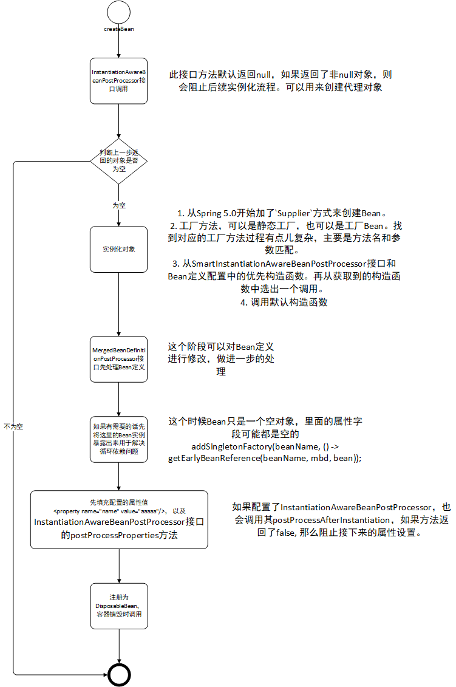
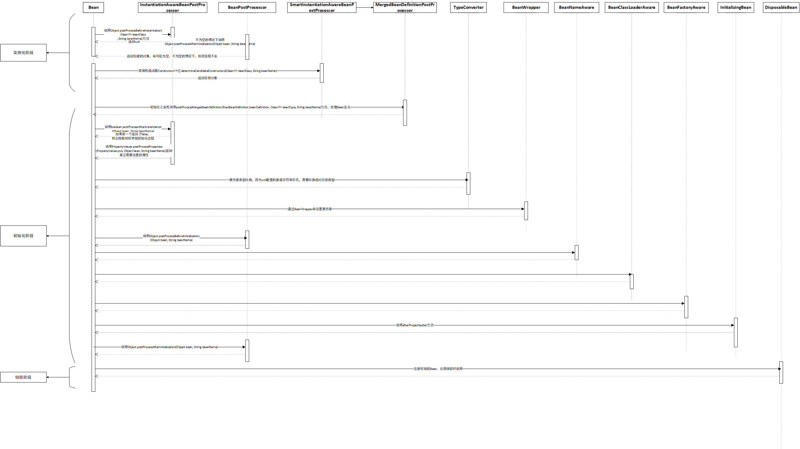

# Bean初始化过程

如果说配置文件好比菜谱，解析配置文件好比洗菜、切菜，那么Bean初始化过程就好比炒菜的过程。Spring的核心基础就建立在对Bean的管理功能上。如何定义一个Bean，如何获取一个Bean，如何初始化一个Bean，如何销毁一个Bean。

## `getBean`方法 -- 炒菜开始的信号

想象一下`getBean`的场景，好比是食客点了一道菜（或者说菜单是由食客提供的，厨房代加工），厨房根据菜单做菜。想象一下在这个过程中需要做哪些工作？

1. 按照菜谱准备菜 -- 解析配置文件
1. 洗菜，切菜 - - 注册Bean定义
2. 炒菜 -- Bean 初始化
3. 添加额外的佐料 -- 动态注册Bean定义

第1，2步可以看成是同时进行的，边准备菜，边洗菜切菜也就是边解析边注册。`getBean` 方法由`BeanFactory`接口提供。

## `BeanFactory`

`BeanFactory`接口是整个Spring容器的核心接口。提供了多个获取 Bean 的方法。

- Object getBean(String name) throws BeansException;
- <T> T getBean(String name, Class<T> requiredType) throws BeansException;
- Object getBean(String name, Object... args) throws BeansException;
- <T> T getBean(Class<T> requiredType) throws BeansException;
- <T> T getBean(Class<T> requiredType, Object... args) throws BeansException;
- <T> ObjectProvider<T> getBeanProvider(Class<T> requiredType);
- <T> ObjectProvider<T> getBeanProvider(ResolvableType requiredType);

前三个是通过Bean的名字来获取，后面的是通过Bean的Class类型来获取。

### 通过名称获取Bean

在Spring容器中，Bean的名字(id )是唯一的。

1. 先处理名称，获取真正的Bean的名称。

    1. 如果 name 以 `&`开头，去掉`&`。

    2. 处理别名。参数有可能是别名，得跟据别名找到实际注册的 Bean 名称。

       ``` java
       //先看一下别名的结构
       // aliasA --->  name
       // aliasB ---> name
       // name ---> realName
       //name 也可以作为别名来注册，但是不能存在 name 和 alias正好相反的一对注册情况。也就是 alias --> anme, name ---> alias这样成对的出现。
       public String canonicalName(String name) {
       		String canonicalName = name;
       		// Handle aliasing...
       		String resolvedName;
       		do {
       			// 把参数当作别名来取出name, 如果能取到，说明当前参数是别名。将取到的值当作别名，继续取，如果不能取到值，那么这个就是真正的bean的名字了;如果还能取到，那么这个也是别名，重复这个过程，直到不能取到值为止。
                   resolvedName = this.aliasMap.get(canonicalName);
                   
       			if (resolvedName != null) {
       				canonicalName = resolvedName;
       			}
       		}
       		while (resolvedName != null);
       		return canonicalName;
       	}
       ```

2. 检查单例缓存中的单例。也就是说先看看有没有创建好的单例，有的就返回这个单例进一步处理。

3. 没有在单例缓存中获取到Bean，那么就检查父容器中有没有这个Bean定义。当父容器中有这个Bean定义，并且当前容器中没有此Bean定义时，就从父容器中获取。如果父容器中没有，则从当前容器获取。

4. 拿到Bean的定义，先对依赖Bean调用`getBean`方法。

5. 如果Bean定义是单例`singleton`，则创建单例。如果是原型`prototype`，则创建Bean。如果是其他的scope作用域，则调用scope的`get`方法。这里可以看出，我们可以自已定义`scope`来扩展Spring提供的几种`scope`。具体的创建Bean的过程都会调用`createBean`方法。

6. 拿到实例对象之后，如果获取时传了类型，那么将使用`TypeConverter`进行类型转换，如果转换成功，则返回这个Bean，否则将抛出异常。

### 通过Class 类型获取Bean

在Spring中Bean的名称才是唯一的标识，所以根据类型获取Bean，会先获取到所有该类型的Bean 的名称。

1. 获取符合类型的Bean名称。如果有泛型的话，调用`doGetBeanNamesForType(ResolvableType type, boolean includeNonSingletons, boolean allowEagerInit)`方法；没有泛型则调用`getBeanNamesForType(@Nullable Class<?> type, boolean includeNonSingletons, boolean allowEagerInit)`方法。找到一个那就恭喜了。
2. 如果获取的Bean名称多于1个，则需要根据优先权选择出一个名称，然后再跟据这个名称去获取Bean。

### Bean 实例化

Bean的创建以及实例化

作为一个可扩展的框架，Spring在Bean实例化的过程中预留了大量的扩展点用于对框架进行扩展。包括修改Bean定义，获取对象类型，实例化之前，实例化的方式，实例化之后，初始化之前，初始化，初始化之后等方面。具体在`org.springframework.beans.factory.support.AbstractAutowireCapableBeanFactory#createBean(java.lang.String, org.springframework.beans.factory.support.RootBeanDefinition, java.lang.Object[])`方法中实现。

参数： 

- `String beanName`: Bean的名称。
- `RootBeanDefinition mbd`: Bean定义。就像菜谱。
- `Object[] args`: 获取Bean时的参数

大致过程如下：

1. 调用`InstantiationAwareBeanPostProcessor`接口方法。此接口继承自`BeanPostProcessor`，在实例化前和实例化后显式属性设置或自动装配发生之前调用。
   通常用于禁止特定目标bean的默认实例化，例如创建具有特殊目标源的代理对象(池化目标、延迟初始化目标等)，或者实现额外的注入策略，如字段注入。注意: 此接口是一个专用接口，主要用于框架内部使用。建议尽可能实现简单的`BeanPostProcessor`接口，或者继承`InstantiationAwareBeanPostProcessorAdapter`，以便屏蔽对该接口的扩展。
   
   - `postProcessBeforeInstantiation` : 在实例化目标bean之前调用。默认实现返回null。返回的bean对象可以代替目标bean用作代理，从而有效地阻止了目标bean的默认实例化。
     如果此方法返回非空对象，则bean创建过程将短路，不会再调用其他`InstantiationAwareBeanPostProcessor`的`postProcessBeforeInstantiation` 方法。进一步调用`InstantiationAwareBeanPostProcessor`的`postProcessAfterInitialization`方法， 如果某个`InstantiationAwareBeanPostProcessor`的`postProcessAfterInitialization`方法返回了`null`，则将返回上一个不为`null`的对象。
     此方法仅应用于具有bean类的bean定义。尤其是不会应用于带有工厂方法的bean。后处理器可以实现`SmartInstantiationAwareBeanPostProcessor`接口，以便预测它们将在这里返回的bean对象的类型。
     
     ```java
     protected Object applyBeanPostProcessorsBeforeInstantiation(Class<?> beanClass, String beanName) {
     		for (BeanPostProcessor bp : getBeanPostProcessors()) {
     			if (bp instanceof InstantiationAwareBeanPostProcessor) {
     				InstantiationAwareBeanPostProcessor ibp = (InstantiationAwareBeanPostProcessor) bp;
     				Object result = ibp.postProcessBeforeInstantiation(beanClass, beanName);
                     //任意一个返回了非null对象，将导致后续的不会执行
     				if (result != null) {
     					return result;
     				}
     			}
     		}
     		return null;
     	}
     ```
   
   - `postProcessAfterInitialization`: 当`postProcessBeforeInstantiation` 方法返回了非`null`对象时，则会调用此方法做进一步的处理。
   
     ```java
     bean = applyBeanPostProcessorsBeforeInstantiation(targetType, beanName);
     					if (bean != null) {
     						bean = applyBeanPostProcessorsAfterInitialization(bean, beanName);
     					}
     ```
   
     ```java
     public Object applyBeanPostProcessorsAfterInitialization(Object existingBean, String beanName)
     			throws BeansException {
     
     		Object result = existingBean;
     		for (BeanPostProcessor processor : getBeanPostProcessors()) {
     			Object current = processor.postProcessAfterInitialization(result, beanName);
                 //如果当前postProcessAfterInitialization方法返回的为null,则直接返回上一个的结果
     			if (current == null) {
     				return result;
     			}
                 //否则继续调用下一个处理器
     			result = current;
     		}
     		return result;
     	}
     ```
   
     

2. 如果第1步中得到的Bean不为空，则直接会使用这个Bean，不会再调用后续的初始化过程。正如第一步中所说，`InstantiationAwareBeanPostProcessor`接口主要创建目标Bean的代理对象等。

3. 如果第1步中得到的Bean为空，则走常规初始化过程。先创建Bean实例：

   1. 从Spring 5.0开始加了`Supplier`方式来创建Bean。

   2. 工厂方法，可以是静态工厂，也可以是工厂Bean。找到对应的工厂方法过程有点儿复杂，主要是方法名和参数匹配。

   3. 从`SmartInstantiationAwareBeanPostProcessor`接口和Bean定义配置中的优先构造函数。再从获取到的构造函数中选出一个调用。

   4. 调用默认构造函数

      

4. Bean已经创建出来了，接下来就是初始化这个Bean。先调用后处理器`MergedBeanDefinitionPostProcessor`接口的`postProcessMergedBeanDefinition`方法处理Bean定义。此接口用于在运行时对合并的bean定义（原始bean定义的已处理副本）进行后处理。

   例如，`postProcessMergedBeanDefinition`方法可以内省bean定义，以便实际在对bean实例进行后的处理操作之前准备一些缓存的元数据，并且这个接口还允许修改bean定义。
   
   

5. 提前暴露Bean，用于解决循环依赖问题，这个时候的Bean基本是个空的Bean。关键代码如下：

   ```java
   addSingletonFactory(beanName, () -> getEarlyBeanReference(beanName, mbd, bean));
   ```

   先将Bean添加到一个Map中，后面取依赖Bean的时候会先检查这个Map。

6. 真正初始化的过程。包括`InstantiationAwareBeanPostProcessor`接口`postProcessBeforeInitialization`方法，属性填充，Aware接口，`BeanPostProcessor`接口`postProcessBeforeInitialization`方法，`InitializingBean`的`afterPropertiesSet`方法，自定义init方法调用，调用`BeanPostProcessor`接口`postProcessAfterInitialization`方法。

7. 注册`DisposableBean`， 当Bean销毁时回调。

可以看一下下面的流程图，对实例化过程有个大概的了解。



### 初始化过程中的扩展点

这里只区分实例化和初始化两个阶段。可以看一下图：



#### 实例化之前

在实例化之前`InstantiationAwareBeanPostProcessor`有机会去阻拦常规的初始化流程，可以创建我们的代理对象。主要涉及到`Object postProcessBeforeInstantiation(Class<?> beanClass, String beanName)`和`Object postProcessAfterInitialization(Object bean, String beanName)`方法。这里`Object postProcessAfterInitialization(Object bean, String beanName)`方法实际上是`BeanPostProcessor`接口的方法，主要用在Bean初始化后做一些自定义操作。**这个方法其实应该归到初始化之后阶段**。

如果上面返回的是`null`，那么则走常规实例化流程。需要的话可以从`SmartInstantiationAwareBeanPostProcessor`接口的`Constructor<?>[] determineCandidateConstructors(Class<?> beanClass, String beanName)`方法中返回构造方法。

#### 实例化之后

通过`MergedBeanDefinitionPostProcessor`接口`postProcessMergedBeanDefinition(RootBeanDefinition beanDefinition, Class<?> beanType, String beanName)`方法获得修改Bean定义的机会，也可以通过这个方法缓存一些数据，辅助后面的初始化过程。

#### 初始化之前

通过`InstantiationAwareBeanPostProcessor`接口boolean postProcessAfterInstantiation(Object bean, String beanName)方法可以阻止(`return false`)接下来的属性设置过程。通过该接口`PropertyValues postProcessProperties(PropertyValues pvs, Object bean, String beanName)`方法处理需要设置的属性。

`TypeConverter` 接口进行属性值的类型转换。XML中配置的属性值是字符串形式的，需要转换成对应的属性类型。

调用`BeanNameAware`、`BeanClassLoaderAware`、`BeanFactoryAware`的设置方法。

#### 初始化

可以将上面的属性设置、Aware接口归到初始化阶段里。

调用`BeanPostProcessor`的`Object postProcessBeforeInitialization(Object bean, String beanName)`方法。

如果Bean实现了`InitializingBean`接口，则会调用`afterPropertiesSet`方法。或者调用自定义的初始化方法。

调用`BeanPostProcessor`接口的`Object postProcessAfterInitialization(Object bean, String beanName)`方法。

#### 销毁

如果Bean注册了销毁方法，则会注册为`DisposableBean`，当Bean销毁时会调用此方法。