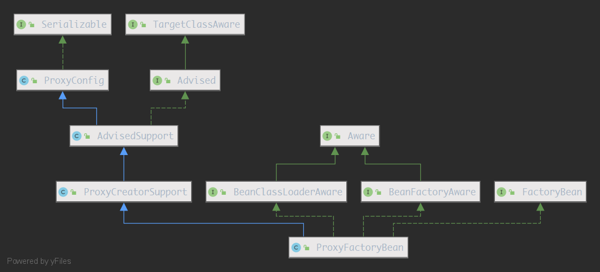
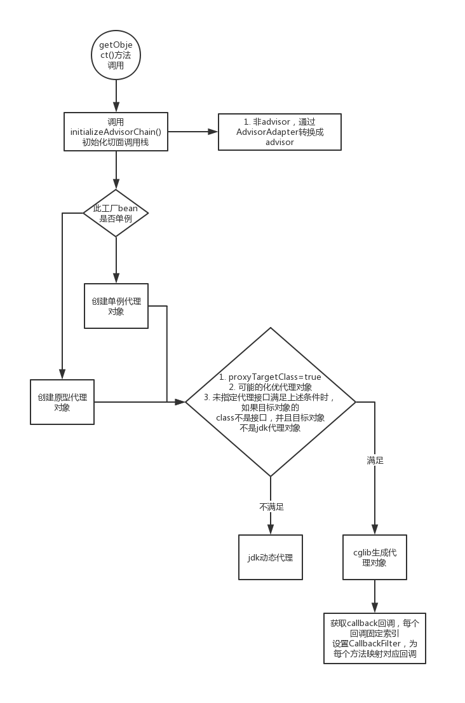
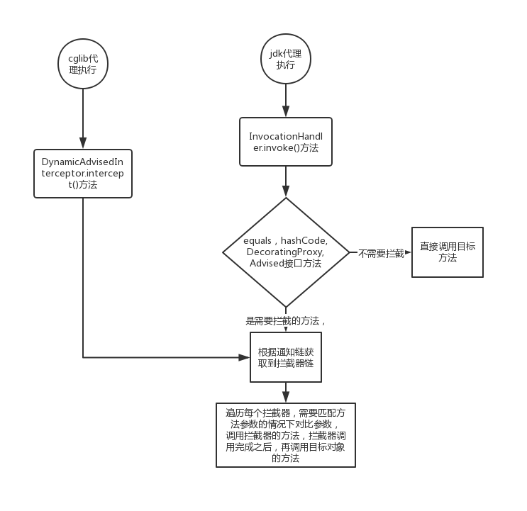

# Spring AOP 用法

前面讲到了AOP相关的思想和基本概念，实现方式可分为静态编绎型和代理两种方式。前者的代表作是`AspectJ`，在编绎阶段将通知织入到class中，需要用到特殊的工具来编绎。`AspectJ`定义了一种表达式语言来定义连接点，Spring 默认是基于JDK动态代理来实现AOP，并且只支持方法作为切入点。

## 如何使用

Spring 自己实现了一套AOP，还部分支持`AspectJ`。两种方式都可以使用编程式和xml配置方式。

使用Spring AOP大概有以下几种方式：

1. 在xml中配置`ProxyFactoryBean`，显式地设置advisors, advice, target等，或以编程方式使用`ProxyFactory`。Spring支持通过 jdk 动态代理和 cglib 来生成代理对象。前者只支持接口，后者可以支持类。还可以以编程形式配置`AspectJProxyFactory`, 该类基于apsectj语法来配置切面。
2. 配置`AutoProxyCreator`，这种方式下，还是如以前一样使用定义的bean，但是从容器中获得的其实已经是代理对象
3. 通过`<aop:config>`来配置，使用`AspectJ`的语法来定义切入点
4. 通过`<aop:aspectj-autoproxy>`来配置，使用`AspectJ`的注解来标识通知及切入点

### xml 配置 ProxyFactoryBean

1. 创建通知

   这里以前置通知类型为例。

   ```java
   public class UserBeforeAdvice implements MethodBeforeAdvice {
       @Override
       public void before(Method method, Object[] args, Object target) throws Throwable {
           System.out.println("Before method advice");
       }
   }
   ```

2. 创建业务代码

   ```java
   //接口
   public interface IBusinessService {
       String sayHello();
   }
   
   //实现类
   public class BusinessService implements IBusinessService{
       @Override
       public String sayHello(){
           System.out.println("hello");
           return "hello";
       }
   }
   ```

3. 配置代理类

   ```xml
   <!--业务实现-->
   <bean class="cn.sexycode.spring.study.chapter5.BusinessService" id="businessService"/>
   <!--通知实现-->
   <bean class="cn.sexycode.spring.study.chapter5.BusinessBeforeAdvice" id="userBeforeAdvice"/>
   <bean class="org.springframework.aop.framework.ProxyFactoryBean" id="businessProxy">
       <!--代理的接口-->
       <property name="interfaces" value="cn.sexycode.spring.study.chapter5.IBusinessService"/>
       <!--目标对象-->
       <property name="target" ref="businessService"/>
       <!--要应用的通知实现-->
       <property name="interceptorNames" value="userBeforeAdvice"/>
   </bean>
   ```

   1. 配置需要代理的接口，配置了此属性，将会使用Jdk 动态代理生成代理对象
   2. 需要代理的目标对象，即我们的业务对象
   3. 使用的通知bean名称`interceptorNames`，是个数组。如果不配置`targetName`/`target`/`targetSource`属性，数组的最后一个可以是目标对象的名字。这个属性还支持通配符`*`，如：`userBeforeAdvice*`，代表所有以`userBeforeAdvice`开头的bean都会成为通知。但是如果目标对象的名字出现在这个属性时，通配符不能是最后一个。

   经过上面的配置，已经将通知织入到代理对象中了，下面直接获取生成的代理对象，再调用方法即可以看到织入的结果。

4. 获取代理对象

   ```java
   DefaultListableBeanFactory beanFactory = new DefaultListableBeanFactory();
   XmlBeanDefinitionReader xmlBeanDefinitionReader = new XmlBeanDefinitionReader(beanFactory);
   xmlBeanDefinitionReader.loadBeanDefinitions("AopXmlSimpleConfig.xml");
   //获取代理对象
   ((IBusinessService) beanFactory.getBean("businessProxy")).sayHello();
   ```

   这里要注意的是要直接获取代理对象，然后转成我们的接口类型，再调用方法即可。

   输出结果：

   ```
   //打印的是通知的内容
   Before method advice
   //业务代码
   hello
   ```

   

## 实现方式

这种方式其实跟《AOP的基本概念》一文开头描述的思想类似，为每个业务实现类创建代理对象，只不过这里的织入时机已经可以配置了。

那么Spring 是如何生成代理对象的？又是如何织入通知的？

可以想象一下，在获取bean的时候，初始化所有的通知，并创建代理类，在调用代理对象的方法时调用通知的代码和原对象的方法。

看一下该类的类图：



`ProxyFactoryBean`类实现了`FactoryBean`接口。也就是说最终会通过`getObject`方法返回生成的对象。`ProxyConfig`类提供了一些代理对象的配置项，可以确保所有的代理创建器都具有一致的属性。`AdvisedSupport`类管理通知和切面，不提供实际的创建代理的方法，由它的子类去实现。`ProxyCreatorSupport`是代理工厂的基类，提供创建代理对象的公共操作，内部使用可配置的`AopProxyFactory`代理工厂来创建代理，默认的`AopProxyFactory`工厂实现根据情况创建`JdkDynamicAopProxy`或者`JdkDynamicAopProxy`代理。

### getObject 方法

前面讲到了，当Spring初始化此bean时，最终会调用`getObject`方法返回实际的bean。

```java
public Object getObject() throws BeansException {
		initializeAdvisorChain();
		if (isSingleton()) {
			return getSingletonInstance();
		}
		else {
			if (this.targetName == null) {
				logger.info("Using non-singleton proxies with singleton targets is often undesirable. " +
						"Enable prototype proxies by setting the 'targetName' property.");
			}
			return newPrototypeInstance();
		}
	}
```

#### 初始化通知链

第一步就是初始化切面链，配置此代理时，可以应用多个切面，所以最终会形成一个调用链。如果此bean是单例的，则会创建单例对象。

初始化方法`initializeAdvisorChain()`是一个线程同步的方法，方法声明上加了`synchronized`关键字。

初始化切面链时，如果之前已经初始化过，将不会再次初始化。初始化时会遍历所有配置的通知，如果是通配符`*`，则会根据类型`Advisor`和`Interceptor`查找所有的bean，并排序，再判断bean的名称是否匹配前缀，是则认为是一个通知，会将其加入到通知链中。如果不是通配符，再判断该bean或者此代理工厂bean是否单例，是的话则会在`BeanFactory`中查找该bean，加入到链中。不是单例则需要将该通知先记录下来，等到最后创建代理对象时，再创建该通知对象。这里为什么需要这样判断是不是单例？这样可以避免在初始化通知链时创建原型对象，这个时候还不需要初化原型通知对象，在最终使用到此对象时再初始化即可。

在添加通知时，由于`intercepterNames`中即可以是`Advice`也可以是`Advisor`，或者是其他自定义的通知类型（实现`Advice`接口），所以需要将通知转换成`Advisor`(Spring封装了通知以及通知的适用范围)。如果本身就是`Advisor`，则不需要转换。如果是`Advice`，并且是支持通知类型，则转换成`DefaultPointcutAdvisor`。转换时通过适配器`AdvisorAdapter`来判断是否支持该通知。`ProxyFactoryBean`默认使用`GlobalAdvisorAdapterRegistry.getInstance()`方式获取到默认的适配器注册器，可以替换该注册器，添加自定义的适配器。也可以注册`AdvisorAdapterRegistrationManager`，然后注册实现`AdvisorAdapter`的bean，该后处理器会自动注册自定义的适配器。Spring 默认注册了`MethodBeforeAdviceAdapter`、`AfterReturningAdviceAdapter`、`ThrowsAdviceAdapter`三个适配器。通过适配器最终可以将基于`AspectJ`的通知转换成Spring 的`Advisor`，达到设计上的统一。

#### 单例代理对象

到这一步，初始化通知链完毕，根据`isSingleton()`方法决定是返回单例对象还是原型对象。需要返回单例代理对象时，则需要在这一步中创建。

如果之前已经创建过了，则直接返回缓存的单例对象。

如果没有创建过，则需要创建代理对象。

1. 刷新目标对象，从`BeanFactory`中获取到实际的目标对象。并封装成`TargetSource`。

2. 在自动检测接口模式（未指定代理接口里默认为`true`，如果没有指定接口时，将此值设置为`false`来使用cglib创建代理对象）、代理接口未指定、不是代理目标对象的情况下，将获取到目标对象所有的接口，并代理所有接口。

3. 准备工作做完了，接下来就是创建代理对象了。创建之前先激活`AdvisedSupportListener`监听器。这里由默认的`AopProxyFactory`工厂指定了两种创建代理对象的方式，根据情况使用jdk动态代理方式还是cglib方式。满足以下情况时：将使用cglib代理。1). 优化代理（比如说在代理对象创建之后，再更改通知不生效，默认为`false`），2). 直接代理目标对象，3). 用户没有指定代理接口。在上面提到的3点中，如果代理目标类是接口，或者是jdk代理，则还是会使用jdk代理方式。

   ```java
   public AopProxy createAopProxy(AdvisedSupport config) throws AopConfigException {
       if (config.isOptimize() || config.isProxyTargetClass() || hasNoUserSuppliedProxyInterfaces(config)) {
           Class<?> targetClass = config.getTargetClass();
           if (targetClass == null) {
               throw new AopConfigException("TargetSource cannot determine target class: " +
                                            "Either an interface or a target is required for proxy creation.");
           }
           if (targetClass.isInterface() || Proxy.isProxyClass(targetClass)) {
               return new JdkDynamicAopProxy(config);
           }
           return new ObjenesisCglibAopProxy(config);
       }
       else {
           return new JdkDynamicAopProxy(config);
       }
   }
   ```

4. 确定代理方式之后，就是使用对应的方式去创建代理对象了。jdk方式使用`JdkDynamicAopProxy`对象来最终生成代理对象，cglib使用`ObjenesisCglibAopProxy`对象。

#### JDK代理对象

使用jdk代理生成代理对象时，会先确定完整的接口。在原有接口基础上会新加入`SpringProxy`，`Advised`，`DecoratingProxy`接口。创建代理时会将自己作为`InvocationHandler`传进去，`JdkDynamicAopProxy`实现了`InvocationHandler`接口，最终调用代理对象的方法时会执行该接口的方法。

##### invoke方法

`JdkDynamicAopProxy`实现了`InvocationHandler`接口，也就是说当代理对象的方法被调用时，`JdkDynamicAopProxy`的`invoke`方法将会被调用，从而通过`invoke`的实现逻辑完成对目标方法调用的拦截。

主要的逻辑是`equals`，`hashCode`方法的判断，`Advised`和`DecoratingProxy`接口的判断。这些方法需要特殊处理，如果目标类实现了`equals`，`hashCode`方法，那么需要去比较原始对象，否则，直接调用代理对象的`equals`和`hashCode`方法就可以了。。

接下来需要根据当前调用的方法获取到对应的拦截器链，如果拦截器链为空，则表示当前方法不需要拦截，直接调用目标对象的方法就可以了。如果不为空，则表示需要拦截，生成`ReflectiveMethodInvocation`对象，该对象封装了拦截器的调用过程。

###### 获取拦截器链

获取调用方法的拦截器链，目标对象所有的通知，之前已经初始化过了，但是每个方法所需要的不一样，所以这一步还需要根据方法进行过滤。具体逻辑在`AdvisedSupport.getInterceptorsAndDynamicInterceptionAdvice()`方法中，会将结果缓存下来下次直接使用。

```java
public List<Object> getInterceptorsAndDynamicInterceptionAdvice(Method method, @Nullable Class<?> targetClass) {
    MethodCacheKey cacheKey = new MethodCacheKey(method);
    List<Object> cached = this.methodCache.get(cacheKey);
    if (cached == null) {
        cached = this.advisorChainFactory.getInterceptorsAndDynamicInterceptionAdvice(
            this, method, targetClass);
        this.methodCache.put(cacheKey, cached);
    }
    return cached;
}
```

`AdvisedSupport`通过`AdvisorChainFactory`(默认使用`DefaultAdvisorChainFactory`)创建一个拦截链，针对每个已经注册的`Advisor`，如果是`PointcutAdvisor`，获取到对应的`Pointcut`，再得到其`ClassFilter`，检查是否匹配目标类型，类型检查通过之后再得到`MethodMatcher`进行方法匹配。*在获取拦截链阶段，不过滤方法参数*。如果`MethodMatcher`是运行时的(也就是要比较参数的)，则包装成`InterceptorAndDynamicMethodMatcher`，其内部包含当前`MethodMatcher`，在`ReflectiveMethodInvocation`内方法调用时根据方法调用时的参数再判断该拦截器是否可以拦截此方法。

如果是引入`IntroductionAdvisor`，则只需要过滤class即可。

符合要求的通知会通过`AdvisorAdapter`转换成方法拦截器`MethodInterceptor`。

不同的通知类型有相应的拦截器。比如`MethodBeforeAdvice`有`MethodBeforeAdviceInterceptor`与其对应。

```java
public class MethodBeforeAdviceInterceptor implements MethodInterceptor, BeforeAdvice, Serializable {

	private final MethodBeforeAdvice advice;


	/**
	 * Create a new MethodBeforeAdviceInterceptor for the given advice.
	 * @param advice the MethodBeforeAdvice to wrap
	 */
	public MethodBeforeAdviceInterceptor(MethodBeforeAdvice advice) {
		Assert.notNull(advice, "Advice must not be null");
		this.advice = advice;
	}


	@Override
	public Object invoke(MethodInvocation mi) throws Throwable {
		this.advice.before(mi.getMethod(), mi.getArguments(), mi.getThis());
		return mi.proceed();
	}

}
```

在调用该拦截器的invoke方法时，会先调用其持有的advice的before方法，也就是我们的通知方法，然后再继续`MethodInvocation`的方法调用，该设计是常见的链式调用方式。

同理`AfterReturningAdvice`对应的是`AfterReturningAdviceInterceptor`，`ThrowsAdvice`对应`ThrowsAdviceInterceptor`。

###### ReflectiveMethodInvocation 执行拦截器链

在上一步获取拦截器链之后，构造出`ReflectiveMethodInvocation `对象，封装了代理，目标对象，方法，以及拦截器链，然后调用该对象的`proceed`方法。

```java
public Object proceed() throws Throwable {
    //	We start with an index of -1 and increment early.
    if (this.currentInterceptorIndex == this.interceptorsAndDynamicMethodMatchers.size() - 1) {
        return invokeJoinpoint();
    }

    Object interceptorOrInterceptionAdvice =
        this.interceptorsAndDynamicMethodMatchers.get(++this.currentInterceptorIndex);
    if (interceptorOrInterceptionAdvice instanceof InterceptorAndDynamicMethodMatcher) {
        // Evaluate dynamic method matcher here: static part will already have
        // been evaluated and found to match.
        InterceptorAndDynamicMethodMatcher dm =
            (InterceptorAndDynamicMethodMatcher) interceptorOrInterceptionAdvice;
        Class<?> targetClass = (this.targetClass != null ? this.targetClass : this.method.getDeclaringClass());
        if (dm.methodMatcher.matches(this.method, targetClass, this.arguments)) {
            return dm.interceptor.invoke(this);
        }
        else {
            // Dynamic matching failed.
            // Skip this interceptor and invoke the next in the chain.
            return proceed();
        }
    }
    else {
        // It's an interceptor, so we just invoke it: The pointcut will have
        // been evaluated statically before this object was constructed.
        return ((MethodInterceptor) interceptorOrInterceptionAdvice).invoke(this);
    }
}
```

`ReflectiveMethodInvocation`维护一个当前执行拦截器的下标值`currentInterceptorIndex`，从`-1`开始，如果**等于**拦截器链的**长度-1**，则表示拦截器已经执行完了，调用目标对象的方法。

如果不相等，则会调用拦截器的方法。

1. 获取到第一个拦截器，并将`currentInterceptorIndex`+1。
2. 如果拦截器是`InterceptorAndDynamicMethodMatcher`类型，则需要进行参数匹配，匹配上则调用该拦截器的方法。否则调用`ReflectiveMethodInvocation`的`proceed`方法，这里是递归调用。最终结束条件就是下标值是拦截器链的**长度-1**。
3. 如果是普通的`MethodInterceptor`的，则调用`invoke`方法，并将自身传进去。

整个调用过程，其实在`Filter`的使用过程中，我们就已经接触了。在每个过滤器的执行过程中，将链维护对象传递到每个过滤器中，执行完成之后再调用链对象的方法，链对象的方法会继续调用下一个过滤器。如果想终止链的调用，可以不调用链的方法。

#### CGLIB生成的代理对象

使用`ObjenesisCglibAopProxy`对象来生成cglib代理对象时。`ObjenesisCglibAopProxy`继承了`CglibAopProxy`重写了`createProxyClassAndInstance()`方法，支持不需要通过构造器来实例化对象的功能。

cglib生成的代理对象实现aop功能，主要需要设置callback。

可以看一下`getProxy`方法：

```java
public Object getProxy(@Nullable ClassLoader classLoader) {
    if (logger.isTraceEnabled()) {
        logger.trace("Creating CGLIB proxy: " + this.advised.getTargetSource());
    }

    try {
        Class<?> rootClass = this.advised.getTargetClass();
        Assert.state(rootClass != null, "Target class must be available for creating a CGLIB proxy");

        Class<?> proxySuperClass = rootClass;
        if (ClassUtils.isCglibProxyClass(rootClass)) {
            proxySuperClass = rootClass.getSuperclass();
            Class<?>[] additionalInterfaces = rootClass.getInterfaces();
            for (Class<?> additionalInterface : additionalInterfaces) {
                this.advised.addInterface(additionalInterface);
            }
        }

        // Validate the class, writing log messages as necessary.
        validateClassIfNecessary(proxySuperClass, classLoader);

        // Configure CGLIB Enhancer...
        Enhancer enhancer = createEnhancer();
        if (classLoader != null) {
            enhancer.setClassLoader(classLoader);
            if (classLoader instanceof SmartClassLoader &&
                ((SmartClassLoader) classLoader).isClassReloadable(proxySuperClass)) {
                enhancer.setUseCache(false);
            }
        }
        enhancer.setSuperclass(proxySuperClass);
        enhancer.setInterfaces(AopProxyUtils.completeProxiedInterfaces(this.advised));
        enhancer.setNamingPolicy(SpringNamingPolicy.INSTANCE);
        enhancer.setStrategy(new ClassLoaderAwareUndeclaredThrowableStrategy(classLoader));

        Callback[] callbacks = getCallbacks(rootClass);
        Class<?>[] types = new Class<?>[callbacks.length];
        for (int x = 0; x < types.length; x++) {
            types[x] = callbacks[x].getClass();
        }
        // fixedInterceptorMap only populated at this point, after getCallbacks call above
        enhancer.setCallbackFilter(new ProxyCallbackFilter(
            this.advised.getConfigurationOnlyCopy(), this.fixedInterceptorMap, this.fixedInterceptorOffset));
        enhancer.setCallbackTypes(types);

        // Generate the proxy class and create a proxy instance.
        return createProxyClassAndInstance(enhancer, callbacks);
    }
    catch (CodeGenerationException | IllegalArgumentException ex) {
        throw new AopConfigException("Could not generate CGLIB subclass of " + this.advised.getTargetClass() +
                                     ": Common causes of this problem include using a final class or a non-visible class",
                                     ex);
    }
    catch (Throwable ex) {
        // TargetSource.getTarget() failed
        throw new AopConfigException("Unexpected AOP exception", ex);
    }
}
```

重点就在`getCallbacks`方法里，将`AdvisedSupport`对象封装成`DynamicAdvisedInterceptor`。另外加了一些性能优化相关的逻辑。`equals`和`hashCode`相关的拦截器，这两个方法是需要特殊处理的。以及是否暴露当前代理对象到当前线程中，可以设置`exposeProxy`属性为`true`，然后通过`AopContext.currentProxy()`方法取得当前代理对象。

这里Spring根据用途将callback拆成了多个:`aopInterceptor`、`EqualsInterceptor`、`HashCodeInterceptor`等，然后为`enhancer`设置`CallbackFilter`决定哪些方法使用对应的callback，每个callback对应一个固定值，`CallbackFilter`返回具体的方法所对应的值。

重点看看`DynamicAdvisedInterceptor`，也就是需要应用通知的拦截器。

该类的逻辑跟jdk代理的类似，将拦截器链封装成一个`CglibMethodInvocation`对象，这个类继承自`ReflectiveMethodInvocation`类，该类的逻辑与父类没有什么大的差别。

#### 原型代理对象

当`ProxyFactoryBean`不是单例时，则需要在每次获取时创建代理对象，创建的过程与单例模式区别不大，主要是每次都需要复制一份配置，通过复制出的配置再去创建代理对象，也就是说每个代理对象拥有的配置都是独立的。

#### 小结

创建代理的过程总结如下图：



执行过程如下：



## 代理属性配置

在前面提到了`ProxyFactoryBean`顶层继承了`ProxyConfig`类，该类提供了一些基础属性配置。下面看一下具体有哪些属性以及其作用。

| 属性             | 说明                                                         |
| ---------------- | ------------------------------------------------------------ |
| proxyTargetClass | 是否直接代理目标类，而不只是代理特定的接口。默认设置是`false`。将其设置为`true`，以强制对目标类进行代理。如果目标类是接口，则将为给定接口创建JDK代理。如果目标类是任何其他类，那么将为给定的类创建一个CGLIB代理。 |
| optimize         | 代理是否应该执行积极的优化。“积极的优化”的确切含义在不同的代理之间会有所不同，默认设置是`false`。例如，优化通常意味着在创建代理之后将不能更改通知。由于这个原因，优化在默认情况下是禁用的。 |
| opaque           | 是否应阻止将此配置创建的代理转换为`Advised`来查询代理状态。默认值是`false`，这意味着任何AOP代理都可以被强制转换为`Advised`的，因为会给代理对象加上`Advised`接口。 |
| exposeProxy      | 设置AOP框架是否应该将代理公开为ThreadLocal，以便通过AopContext类获取代理。如果`Advised`的对象需要调用自己另一个被拦截的方法时可以使用这种方式。(如果使用`this`，将不会拦截调用)。默认为“false”，以避免不必要的拦截。尽量不使用此种方式，因为依赖于Spring Aop。 |
| frozen           | 设置这个配置是否应该被冻结。当一个配置被冻结时，无法更改通知。这对于性能优化非常有用，当我们不希望调用者能够在强制转换为`Advised`后操作配置时也非常有用。 |


