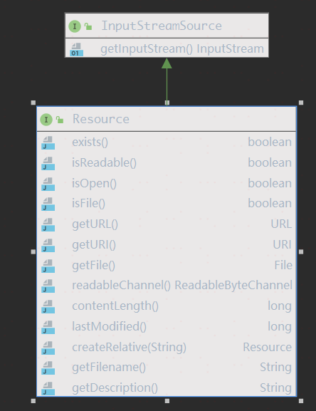

# Bean 定义文件的解析

## 初始化工厂

```java
// 1. 初始化一个bean 工厂
DefaultListableBeanFactory factory = new DefaultListableBeanFactory();
// 2. 初始化XmlBeanDefinitionReader,负责从xml文件中读取bean定义
XmlBeanDefinitionReader reader = new XmlBeanDefinitionReader(factory);
// 3. 加载bean 定义的入口方法
reader.loadBeanDefinitions("classpath:app.xml");
```

上述代码使用起来很简单，创建一个工厂和阅读器，传入配置文件的位置。

我们可以考虑一下，这些代码做了什么。

1. XmlBeanDefinitionReader 是如何定位配置文件的?
2. 如何解析配置文件的？
3. XmlBeanDefinitionReader的构造函数传入了一个BeanDefinitionRegistry对象，这个对象是用来注册bean定义的，那么是如何注册的呢？

## ResourceLoader 定位资源文件

### Resource

Spring将各种资源统一抽象为`Resource`,并使用`ResourceLoader`来定位`Resource`。如果资源以物理形式存在，那么它可以为每个资源打开一个InputStream，但是URL或文件句柄只能由某些特定资源返回。实际的行为取决于实现类。

#### `Resource`的结构

下面是Resource的类关系图


下面是Resource的类结构图



`Resource`继承自`InputStreamSource`, 得到了获取`InputStream`的能力，可以以流的形式读取资源文件。

定义的方法：

- boolean exists()：确定此资源是实际物理存在。此方法执行确定的存在性检查，而资源句柄的存在仅保证有效的描述符句柄。
- boolean isReadable()：指示是否可以通过`getInputStream()`读取此资源的非空内容。对于存在的典型资源描述符会返回`true`，因为从5.1开始它严格地暗示了`exist()`语义。请注意，在尝试读取实际内容时仍然可能失败。但是，如果返回值为`false`，则表示资源内容无法读取。
- boolean isOpen(): 指示此资源是否表示具有打开流的句柄。如果为`true`，则不能多次读取InputStream，必须读取并关闭该资源，以避免资源泄漏。对于典型的资源描述符将为false。
- boolean isFile()：确定此资源是否表示文件系统中的文件。返回`true`标志着(但不保证)`getFile()`将调用成功。
这在默认情况下返回`false`.
- URL getURL(): 返回此资源的URL句柄。
- URI getURI(): 返回此资源的URI句柄。
- File getFile(): 返回此资源的文件句柄。如果资源不能被解析为绝对文件路径，也就是说，如果资源在文件系统中不可用将抛出`FileNotFoundException`异常。
- ReadableByteChannel readableChannel()：返回一个`ReadableByteChannel`。希望每次调用都创建一个新的通道。
默认实现返回`Channels.newChannel(getInputStream())`。
- long contentLength()：确定此资源的内容长度。
- long lastModified()：确定此资源最后修改的时间戳。
- Resource createRelative(String relativePath)：创建与此资源相对路径的资源。
- String getFilename()：确定此资源的文件名，通常是路径的最后一部分:例如，“myfile.txt”。如果此类资源没有文件名，则返回`null`。
- String getDescription(): 返回此资源的描述，用于处理该资源时的错误输出。实现类可以从它们的`toString`方法返回这个值。

#### Resource 的子接口

##### ContextResource

用于从封闭的“上下文”(例如从`javax.servlet.ServletContext`)加载资源的扩展接口，也可以从普通类路径或相对于文件系统路径(没有显式指定前缀，因此应用于相对于本地`ResourceLoader`的上下文)。

定义的方法：

- String getPathWithinContext()：返回包含在“上下文”中的路径。通常是相对于上下文特定的根目录的路径，例如`ServletContext`根目录或`PortletContext`根目录。

##### WritableResource

支持对资源进行写入的扩展接口。该接口提供一个`OutputStream`访问器。

定义的方法：

- boolean isWritable()：指示是否可以通过`getOutputStream()`向此资源写入内容。适用于典型的资源描述符;注意，实际在尝试写入时仍然可能失败。但是，如果值为false，则表示资源内容不能修改
- OutputStream getOutputStream()：返回底层资源的`OutputStream`，允许(过度)写入其内容.
- WritableByteChannel writableChannel(): 返回一个`WritableByteChannel`。希望每个调用都创建一个新的通道。默认实现返回`Channels.newChannel(getOutputStream())`。

##### HttpResource

将资源写入HTTP响应的扩展接口

定义的方法：

- HttpHeaders getResponseHeaders(): 服务于当前资源的HTTP响应头。

#### 常用的`Resource`实现类

##### ClassPathResource

类路径资源的实现类。使用给定的类加载器或给定的类来加载资源。如果类路径资源驻留在文件系统中，而不是JAR中的资源，则支持`java.io.File`方式来加载。该类始终支持URL方式来加载。

使用示例：

```java
ClassPathResource resource = new ClassPathResource("app.xml");
System.out.println("资源文件是否存在：" + resource.exists());
System.out.println("资源文件是否是文件：" + resource.isFile());
System.out.println("资源文件是否可读：" + resource.isReadable());
System.out.println("资源文件名称：" + resource.getFilename());
System.out.println("资源文件：" + resource.getFile());
System.out.println("资源文件描述：" + resource.getDescription());
System.out.println("资源文件URL：" + resource.getURL());
System.out.println("资源文件URI：" + resource.getURI());
System.out.println("资源文件长度：" + resource.contentLength());
System.out.println("资源文件最后修改时间：" + new Date(resource.lastModified()));
System.out.println("资源文件数据：" + new String(resource.getInputStream().readAllBytes()));
Resource resourceRelative = resource.createRelative("relative.xml");
System.out.println("相对路径资源：" + resourceRelative);
System.out.println("相对路径资源是否存在：" + resourceRelative.exists());
System.out.println("相对路径资源文件：" + resourceRelative.getFile());

//输出结果
资源文件是否存在：true
资源文件是否是文件：true
资源文件是否可读：true
资源文件名称：app.xml
资源文件：F:\spring-code-study\chapter3\target\classes\app.xml
资源文件描述：class path resource [app.xml]
资源文件URL：file:/F:/spring-code-study/chapter3/target/classes/app.xml
资源文件URI：file:/F:/spring-code-study/chapter3/target/classes/app.xml
资源文件长度：307
资源文件最后修改时间：Mon Apr 08 10:40:17 CST 2019
资源文件数据：<?xml version="1.0" encoding="UTF-8"?>
<beans xmlns="http://www.springframework.org/schema/beans"
       xmlns:xsi="http://www.w3.org/2001/XMLSchema-instance"
       xsi:schemaLocation="http://www.springframework.org/schema/beans http://www.springframework.org/schema/beans/spring-beans.xsd">

</beans>
相对路径资源：class path resource [relative.xml]
相对路径资源是否存在：false
Exception in thread "main" java.io.FileNotFoundException: class path resource [relative.xml] cannot be resolved to URL because it does not exist
	at org.springframework.core.io.ClassPathResource.getURL(ClassPathResource.java:195)
	at org.springframework.core.io.AbstractFileResolvingResource.getFile(AbstractFileResolvingResource.java:150)
	at cn.sexycode.spring.study.chapter3.ClassPathResourceDemo.main(ClassPathResourceDemo.java:30)

```

##### FileSystemResource

处理`java.io.File`和`java.nio.file.Path`文件系统的资源实现。支持作为一个文件，也可以作为一个URL。扩展自`WritableResource`接口。

**注意:从Spring Framework 5.0开始，这个资源实现使用NIO.2 API进行读/写交互。从5.1开始，它可能使用一个`java.nio.file.Path`句柄实例化，在这种情况下，它将通过NIO.2执行所有文件系统交互，
只能通过`getFile()`来返回`File`**


### ResourceLoader

加载资源的策略接口(例如类路径或文件系统资源)。`org.springframework.context.ApplicationContext`需要提供此功能，以及扩展`org.springframework.core.io.support.ResourcePatternResolver`支持。
`DefaultResourceLoader`是一个独立的实现，可以在`ApplicationContext`之外使用，也可以由`ResourceEditor`使用。
当在`ApplicationContext`中使用时，可以使用特定上下文的资源加载策略从字符串填充Resource类型和Resource数组的Bean属性。

ResourceLoader提供的方法：

- Resource getResource(String location)：返回指定资源位置的资源句柄。
句柄应该始终是一个可重用的资源描述符，允许多次调用`Resource#getInputStream()`。
必须支持完全限定的url，例如。“file:C:/test.dat”。
必须支持类路径伪url，例如。“classpath:test.dat”。
应该支持相对文件路径，例如。“WEB-INF/test.dat”。(这是基于特定实现的，通常由`ApplicationContext`实现类提供。)
**注意，资源句柄并不意味着资源实际存在;还是需要调用`Resource#exists`检查资源是否存在**

#### `ResourcePatternResolver`子接口

用于将位置模式(例如，ant样式的路径模式)解析为资源对象的策略接口。
这是ResourceLoader接口的扩展。可以检查传入的ResourceLoader(例如，当运行在上下文中时，通过`ResourceLoaderAware`传入的`ApplicationContext`)是否也实现了这个接口。
`PathMatchingResourcePatternResolver`是一个独立的实现，可以在ApplicationContext之外使用，`ResourceArrayPropertyEditor`也使用它来填充bean的`Resource` 数组属性。
可以与任何类型的位置模式(例如`/WEB-INF/*-context.xml`):输入模式必须匹配策略实现。这个接口只指定转换方法，而不是特定的模式格式。
这个接口还为类路径中所有匹配的资源提供了一个新的资源前缀`classpath*:`。注意，在这种情况下，资源位置应该是一个没有占位符的路径(例如 `/beans.xml`);JAR文件或类目录可以包含多个同名文件

此接口提供的方法：

- Resource[] getResources(String locationPattern)：将给定的位置模式解析为资源对象。应该尽可能避免指向相同物理资源的重复资源项。结果应该具有set语义

#### 常用实现类

##### DefaultResourceLoader

`ResourceLoader`接口的默认实现。由`ResourceEditor`使用，并作为`org.springframework.context.support.AbstractApplicationContext`的基类。也可以单独使用。
如果位置值是URL，则返回UrlResource;如果非URL路径或“classpath:”伪URL，则返回ClassPathResource。

这里提到了URL, URL 是用来在互联网中描述一个资源位置的，主要包括协议，主机，路径等组成部分。

Spring 支持的URL:

- classpath: 表示classpath下的资源文件
- file： 表示文件系统中的资源文件
- jar： 表示jar包中的资源文件
- war： 表示war包中的资源文件
- zip：zip包中的资源文件
- wsjar： WebSphere jar文件
- vfszip：JBoss jar文件
- vfsfile：JBoss 文件系统
- vfs：通用的JBoss VFS 文件

使用示例：

```java
DefaultResourceLoader resourceLoader = new DefaultResourceLoader();
//读取file文件
System.out.println("------------------------------------读取本地文件------------------" );
Resource resource = resourceLoader.getResource("file:///F:\\spring-code-study\\chapter3\\target\\classes/app.xml");
System.out.println("资源文件是否存在：" + resource.exists());
System.out.println("资源文件是否是文件：" + resource.isFile());
System.out.println("资源文件是否可读：" + resource.isReadable());
//        System.out.println("资源文件是否可写：" + ((FileSystemResource)resource).isWritable());
System.out.println("资源文件名称：" + resource.getFilename());
System.out.println("资源文件：" + resource.getFile());
System.out.println("资源文件描述：" + resource.getDescription());
System.out.println("资源文件URL：" + resource.getURL());
System.out.println("资源文件URI：" + resource.getURI());
System.out.println("资源文件长度：" + resource.contentLength());
System.out.println("资源文件最后修改时间：" + new Date(resource.lastModified()));
System.out.println("资源文件数据：" + new String(resource.getInputStream().readAllBytes()));

//读取jar包中的文件
System.out.println("------------------------------------读取jar文件----------------------" );
resource = resourceLoader.getResource("jar:file:///F:\\spring-code-study\\chapter3\\target\\chapter3-1.0-SNAPSHOT.jar!/app.xml");
System.out.println("资源文件是否存在：" + resource.exists());
System.out.println("资源文件是否是文件：" + resource.isFile());
System.out.println("资源文件是否可读：" + resource.isReadable());
//        System.out.println("资源文件是否可写：" + ((FileSystemResource)resource).isWritable());
System.out.println("资源文件名称：" + resource.getFilename());
//        System.out.println("资源文件：" + resource.getFile());
System.out.println("资源文件描述：" + resource.getDescription());
System.out.println("资源文件URL：" + resource.getURL());
//        System.out.println("资源文件URI：" + resource.getURI());
System.out.println("资源文件长度：" + resource.contentLength());
System.out.println("资源文件最后修改时间：" + new Date(resource.lastModified()));
System.out.println("资源文件数据：" + new String(resource.getInputStream().readAllBytes()));

//读取网络文件
System.out.println("------------------------------------读取网络文件-----------------" );
resource = resourceLoader.getResource("https://raw.githubusercontent.com/qzzsunly/spring-code-study/master/chapter3/src/main/resources/app.xml");
System.out.println("资源文件是否存在：" + resource.exists());
System.out.println("资源文件是否是文件：" + resource.isFile());
System.out.println("资源文件是否可读：" + resource.isReadable());
//        System.out.println("资源文件是否可写：" + ((FileSystemResource)resource).isWritable());
System.out.println("资源文件名称：" + resource.getFilename());
//        System.out.println("资源文件：" + resource.getFile());
System.out.println("资源文件描述：" + resource.getDescription());
System.out.println("资源文件URL：" + resource.getURL());
//        System.out.println("资源文件URI：" + resource.getURI());
System.out.println("资源文件长度：" + resource.contentLength());
System.out.println("资源文件最后修改时间：" + new Date(resource.lastModified()));
System.out.println("资源文件数据：" + new String(resource.getInputStream().readAllBytes()));


//读取classpath下的文件
System.out.println("------------------------------------读取classpath文件-----------------" );
resource = resourceLoader.getResource("classpath:app.xml");
System.out.println("资源文件是否存在：" + resource.exists());
System.out.println("资源文件是否是文件：" + resource.isFile());
System.out.println("资源文件是否可读：" + resource.isReadable());
//        System.out.println("资源文件是否可写：" + ((FileSystemResource)resource).isWritable());
System.out.println("资源文件名称：" + resource.getFilename());
//        System.out.println("资源文件：" + resource.getFile());
System.out.println("资源文件描述：" + resource.getDescription());
System.out.println("资源文件URL：" + resource.getURL());
//        System.out.println("资源文件URI：" + resource.getURI());
System.out.println("资源文件长度：" + resource.contentLength());
System.out.println("资源文件最后修改时间：" + new Date(resource.lastModified()));
System.out.println("资源文件数据：" + new String(resource.getInputStream().readAllBytes()));

```

测试结果：

```plain
------------------------------------读取本地文件------------------
资源文件是否存在：true
资源文件是否是文件：true
资源文件是否可读：true
资源文件名称：app.xml
资源文件：F:\spring-code-study\chapter3\target\classes\app.xml
资源文件描述：URL [file:/F:/spring-code-study/chapter3/target/classes/app.xml]
资源文件URL：file:/F:/spring-code-study/chapter3/target/classes/app.xml
资源文件URI：file:/F:/spring-code-study/chapter3/target/classes/app.xml
资源文件长度：307
资源文件最后修改时间：Mon Apr 08 10:40:17 CST 2019
资源文件数据：<?xml version="1.0" encoding="UTF-8"?>
<beans xmlns="http://www.springframework.org/schema/beans"
       xmlns:xsi="http://www.w3.org/2001/XMLSchema-instance"
       xsi:schemaLocation="http://www.springframework.org/schema/beans http://www.springframework.org/schema/beans/spring-beans.xsd">

</beans>
------------------------------------读取jar文件----------------------
资源文件是否存在：true
资源文件是否是文件：false
资源文件是否可读：true
资源文件名称：app.xml
资源文件描述：URL [jar:file:///F:\spring-code-study\chapter3\target\chapter3-1.0-SNAPSHOT.jar!/app.xml]
资源文件URL：jar:file:///F:\spring-code-study\chapter3\target\chapter3-1.0-SNAPSHOT.jar!/app.xml
资源文件长度：307
资源文件最后修改时间：Wed Apr 10 09:05:03 CST 2019
资源文件数据：<?xml version="1.0" encoding="UTF-8"?>
<beans xmlns="http://www.springframework.org/schema/beans"
       xmlns:xsi="http://www.w3.org/2001/XMLSchema-instance"
       xsi:schemaLocation="http://www.springframework.org/schema/beans http://www.springframework.org/schema/beans/spring-beans.xsd">

</beans>
------------------------------------读取网络文件-----------------
资源文件是否存在：true
资源文件是否是文件：false
资源文件是否可读：true
资源文件名称：app.xml
资源文件描述：URL [https://raw.githubusercontent.com/qzzsunly/spring-code-study/master/chapter3/src/main/resources/app.xml]
资源文件URL：https://raw.githubusercontent.com/qzzsunly/spring-code-study/master/chapter3/src/main/resources/app.xml
资源文件长度：302
资源文件最后修改时间：Thu Jan 01 08:00:00 CST 1970
资源文件数据：<?xml version="1.0" encoding="UTF-8"?>
<beans xmlns="http://www.springframework.org/schema/beans"
       xmlns:xsi="http://www.w3.org/2001/XMLSchema-instance"
       xsi:schemaLocation="http://www.springframework.org/schema/beans http://www.springframework.org/schema/beans/spring-beans.xsd">

</beans>
------------------------------------读取classpath文件-----------------
资源文件是否存在：true
资源文件是否是文件：true
资源文件是否可读：true
资源文件名称：app.xml
资源文件描述：class path resource [app.xml]
资源文件URL：file:/F:/spring-code-study/chapter3/target/classes/app.xml
资源文件长度：307
资源文件最后修改时间：Mon Apr 08 10:40:17 CST 2019
资源文件数据：<?xml version="1.0" encoding="UTF-8"?>
<beans xmlns="http://www.springframework.org/schema/beans"
       xmlns:xsi="http://www.w3.org/2001/XMLSchema-instance"
       xsi:schemaLocation="http://www.springframework.org/schema/beans http://www.springframework.org/schema/beans/spring-beans.xsd">

</beans>
```

从上面的例子中可以看到使用`ResourceLoader`和`Resource`接口，我们可以很方便的读取文件内容。

##### PathMatchingResourcePatternResolver

此实现支持ant风格的通配符形式路径。在有多个文件的情况下，我们可以利用这个类来加载多个配置文件。

###### 在没有通配符的情况

如果指定的路径没有`classpath*:`前缀，将通过底层ResourceLoader的getResource()返回单个的资源。比如“file:C:/context”。“classpath:/context”这样的伪url，以及简单的无前缀路径，如“/WEB-INF/context.xml”，后者将基于底层ResourceLoader的方式解析(例如，用于WebApplicationContext的ServletContextResource)。

###### Ant 风格的路径

当路径包含一个ant样式的模式时，例如:`/WEB-INF/*-context.xml`、`com/mycompany/**/applicationContext.xml`、`file:C:/some/path/*-context.xml`、`classpath:com/mycompany/**/applicationContext.xml`, 解析器遵循一个更复杂但是已定义好的算法来尝试解析通配符。它为最后一个非通配符部分的路径生成一个资源，并获取一个URL。如果该URL不是`jar:` URL或特定于容器的变体(例如WebLogic中的`zip:`，WebSphere中的`wsjar`等等)，那么将从它获取`java.io.File`，并通过遍历文件系统来解析通配符。对于jar URL，解析器要么从中获取java.net.JarURLConnection，要么手动解析jar URL，然后遍历jar文件的内容来以解析通配符

###### 可移植性影响

如果指定的路径已经是文件URL(由于基本ResourceLoader是基于文件系统的，所以可以显式或隐式地使用)，那么通配符就可以方便移植。如果指定的路径是类路径，那么解析器必须通过调用`Classloader.getResource()`获得最后一个非通配符路径部分的URL。由于这只是路径的一个节点(而不是末尾的文件)，所以它实际上是未定义的(在ClassLoader 的文档中有提及)。实际上，它通常是一个表示目录的`java.io.File`，其中类路径资源解析为文件系统位置，或者是某种jar URL，其中类路径解析为jar所在位置。尽管如此，这个操作仍然存在可移植性问题。为了从最后一个非通配符部分获取jar URL，解析器必须能够从中获得`java.net.JarURLConnection`，或者手动解析jar URL，以便能够遍历jar的内容并解析通配符。这将在大多数环境中工作，但在其他环境中可能会失败，强烈建议在依赖jar之前，在你的特定环境中彻底测试jar包资源的通配符解析。

###### classpath*:前缀

支持通过`classpath*:`前缀检索同名的多个类路径资源。例如,`classpath*:META-INF/beans.xml`将找到classpath下所有的`beans.xml`文件，无论是在`classes`目录中还是在JAR文件中。这对于自动检测每个jar文件中的相同位置的相同名称的配置文件特别有用。在内部是通过`ClassLoader.getResources()`方法实现的，并且是完全可移植的。`classpath*:`前缀还可以结合`PathMatcher` 模式，例如`classpath*:META-INF/*-beans.xml`。在本例中，解析策略相当简单:在最后一个非通配符路径部分上调用`ClassLoader.getResources()`来获取类加载器层次结构中所有匹配的资源，然后在每个资源之外使用上面描述的相同路径匹配器解析策略来处理通配符子路径。

###### 另注

警告: 注意，`classpath*:`与ant样式的模式结合使用时，根目录在文件系统中必须存在。这意味着像`classpath*:*.xml`这样的模式不会从jar文件的根中检索文件，而是只从扩展目录的根中检索。这源于JDK的`ClassLoader.getResources()`方法中的一个限制，该方法传入空字符串只返回文件系统位置(指示潜在的要搜索的根目录)。这个`ResourcePatternResolver`实现试图通过URLClassLoader自省和`java.class.path`清单来减轻jar根目录查找的限制;但是不保证可移植性。
**警告: 当`classpath:`搭配Ant风格时，如果在多个类路径位置都能搜索到根包，则不能保证资源能够找到匹配的资源。这是因为如
`com/mycompany/package1/service-context.xml`这样的资源可能只在一个位置，但当尝试解析这样路径时:`com/mycompany/**/service-context.xml`,解析器在处理`getResource(com/mycompany”)`返回的(第一个)URL，如果此存在于多个类加载器时，则实际的想要的资源可能不在返回的类加载器中。因此，在这种情况下，最好使用具有相同ant样式模式的`classpath*:`，它将搜索包含根包的所有类路径。**

###### 使用示例

```java

PathMatchingResourcePatternResolver resourceLoader = new PathMatchingResourcePatternResolver();
//读取file文件
System.out.println("------------------------------------读取多个文件------------------");
Resource[] resources = resourceLoader.getResources("classpath:app*.xml");
for (Resource resource : resources) {

    System.out.println("资源文件是否存在：" + resource.exists());
    System.out.println("资源文件是否是文件：" + resource.isFile());
    System.out.println("资源文件是否可读：" + resource.isReadable());
//        System.out.println("资源文件是否可写：" + ((FileSystemResource)resource).isWritable());
    System.out.println("资源文件名称：" + resource.getFilename());
    System.out.println("资源文件：" + resource.getFile());
    System.out.println("资源文件描述：" + resource.getDescription());
    System.out.println("资源文件URL：" + resource.getURL());
    System.out.println("资源文件URI：" + resource.getURI());
    System.out.println("资源文件长度：" + resource.contentLength());
    System.out.println("资源文件最后修改时间：" + new Date(resource.lastModified()));
    System.out.println("资源文件数据：" + new String(resource.getInputStream().readAllBytes()));

}
    
```

结果：

```text
------------------------------------读取多个文件------------------
资源文件是否存在：true
资源文件是否是文件：true
资源文件是否可读：true
资源文件名称：app0.xml
资源文件：F:\spring-code-study\chapter3\target\classes\app0.xml
资源文件描述：file [F:\spring-code-study\chapter3\target\classes\app0.xml]
资源文件URL：file:/F:/spring-code-study/chapter3/target/classes/app0.xml
资源文件URI：file:/F:/spring-code-study/chapter3/target/classes/app0.xml
资源文件长度：331
资源文件最后修改时间：Wed Apr 10 20:57:17 CST 2019
资源文件数据：<?xml version="1.0" encoding="UTF-8"?>
<beans xmlns="http://www.springframework.org/schema/beans"
       xmlns:xsi="http://www.w3.org/2001/XMLSchema-instance"
       xsi:schemaLocation="http://www.springframework.org/schema/beans http://www.springframework.org/schema/beans/spring-beans.xsd">
    <!--配置文件0-->
</beans>
资源文件是否存在：true
资源文件是否是文件：true
资源文件是否可读：true
资源文件名称：app1.xml
资源文件：F:\spring-code-study\chapter3\target\classes\app1.xml
资源文件描述：file [F:\spring-code-study\chapter3\target\classes\app1.xml]
资源文件URL：file:/F:/spring-code-study/chapter3/target/classes/app1.xml
资源文件URI：file:/F:/spring-code-study/chapter3/target/classes/app1.xml
资源文件长度：331
资源文件最后修改时间：Wed Apr 10 10:46:52 CST 2019
资源文件数据：<?xml version="1.0" encoding="UTF-8"?>
<beans xmlns="http://www.springframework.org/schema/beans"
       xmlns:xsi="http://www.w3.org/2001/XMLSchema-instance"
       xsi:schemaLocation="http://www.springframework.org/schema/beans http://www.springframework.org/schema/beans/spring-beans.xsd">
    <!--配置文件1-->
</beans>
资源文件是否存在：true
资源文件是否是文件：true
资源文件是否可读：true
资源文件名称：app2.xml
资源文件：F:\spring-code-study\chapter3\target\classes\app2.xml
资源文件描述：file [F:\spring-code-study\chapter3\target\classes\app2.xml]
资源文件URL：file:/F:/spring-code-study/chapter3/target/classes/app2.xml
资源文件URI：file:/F:/spring-code-study/chapter3/target/classes/app2.xml
资源文件长度：331
资源文件最后修改时间：Wed Apr 10 10:46:50 CST 2019
资源文件数据：<?xml version="1.0" encoding="UTF-8"?>
<beans xmlns="http://www.springframework.org/schema/beans"
       xmlns:xsi="http://www.w3.org/2001/XMLSchema-instance"
       xsi:schemaLocation="http://www.springframework.org/schema/beans http://www.springframework.org/schema/beans/spring-beans.xsd">
    <!--配置文件2-->
</beans>
```

## BeanDefinitionReader 加载bean定义资源

通过`ResourceLoader` 定位资源文件之后，那么就该`BeanDefinitionReader`开始着手加载bean定义了。

定义的方法：

- int loadBeanDefinitions(Resource resource)：从单个资源中加载，返回发现的bean 定义数量
- int loadBeanDefinitions(Resource... resources)：从多个资源中加载
- int loadBeanDefinitions(String location)：从单个资源位置加载
- int loadBeanDefinitions(String... locations)：从多个资源位置加载

从方法定义中可以看出，`BeanDefinitionReader`提供了多个从各种资源中加载bean定义的功能。

### BeanDefinitionReader 实现类

Spring 提供了三个实现类，用于从不同格式的资源文件中加载bean定义。

#### PropertiesBeanDefinitionReader

该类用于从properties文件中加载bean定义。

#### GroovyBeanDefinitionReader

基于Groovy的 reader。
这个bean定义reader还可以读取XML bean定义文件，允许与Groovy bean定义文件无缝搭配。

#### XmlBeanDefinitionReader

读取xml bean定义文件，将资源解析成xml w3c document, 内部委托给`BeanDefinitionDocumentReader`接口(具体实现类是`DefaultBeanDefinitionDocumentReader`)去加载。

```java
protected void doRegisterBeanDefinitions(Element root) {
		// Any nested <beans> elements will cause recursion in this method. In
		// order to propagate and preserve <beans> default-* attributes correctly,
		// keep track of the current (parent) delegate, which may be null. Create
		// the new (child) delegate with a reference to the parent for fallback purposes,
		// then ultimately reset this.delegate back to its original (parent) reference.
		// this behavior emulates a stack of delegates without actually necessitating one.
		//任何内部的 <beans> 标签，将会递归调用这个方法， 为了正确地传播和保存<beans> 的`default-`属性值，需要跟踪当前(父)委托，它有可能为空。
		//因为子beans 需要继承父beans的一些默认属性，比如说default-lazy-init="default", 
		//创建新的(子)委托，并使用父委托的引用进行回退，然后最终将this.delegate重置为其原始(父)引用。这种行为模拟了一堆委托，实际上并不需要委托。
		BeanDefinitionParserDelegate parent = this.delegate;
		// 为当前根节点创建新的委托解析器
		this.delegate = createDelegate(getReaderContext(), root, parent);

        //判断当前标签是不是在默认命名空间中，默认命名空间代表<benas>标签所在的命名空间
		if (this.delegate.isDefaultNamespace(root)) {
		    //当前<beans> 标签指定了profile属性，则跟当前环境中激活的profile进行比较，如果是未激活，则跳过当前<beans> 标签
			String profileSpec = root.getAttribute(PROFILE_ATTRIBUTE);
			if (StringUtils.hasText(profileSpec)) {
				String[] specifiedProfiles = StringUtils.tokenizeToStringArray(
						profileSpec, BeanDefinitionParserDelegate.MULTI_VALUE_ATTRIBUTE_DELIMITERS);
				// We cannot use Profiles.of(...) since profile expressions are not supported
				// in XML config. See SPR-12458 for details.
				if (!getReaderContext().getEnvironment().acceptsProfiles(specifiedProfiles)) {
					if (logger.isDebugEnabled()) {
						logger.debug("Skipped XML bean definition file due to specified profiles [" + profileSpec +
								"] not matching: " + getReaderContext().getResource());
					}
					return;
				}
			}
		}

		preProcessXml(root);
		
		//解析当前<beans>标签
		parseBeanDefinitions(root, this.delegate);
		postProcessXml(root);

		this.delegate = parent;
	}
```

BeanDefinitionParserDelegate 对象是用来具体解析每个元素的，为什么需要创建一个新的。可以

再看看parseBeanDefinitions方法
```java
//如果当前元素属于默认命名空间，这里其实就是指<beans>标签
if (delegate.isDefaultNamespace(root)) {
    NodeList nl = root.getChildNodes();
    //遍历子节点
    for (int i = 0; i < nl.getLength(); i++) {
        Node node = nl.item(i);
        if (node instanceof Element) {
            Element ele = (Element) node;
            if (delegate.isDefaultNamespace(ele)) {
                //如果该标签属性默认命名空间，Uri为空，或者是 http://www.springframework.org/schema/beans
                // import标签
                if (delegate.nodeNameEquals(ele, IMPORT_ELEMENT)) {
                    // 先处理路径中的点位符，如：${user.dir}
                    // 判断引入的资源是否绝对路径(classpath:, classpath*:, url资源)，再调用reader的loadBeanDefinitions 方法
                    // 相对路径则使用 当前的资源创建相对路径资源（getReaderContext().getResource().createRelative(location)）
                    //再调用reader的loadBeanDefinitions 方法
                    importBeanDefinitionResource(ele);
                }
                //alias 标签
                else if (delegate.nodeNameEquals(ele, ALIAS_ELEMENT)) {
                    //调用org.springframework.core.AliasRegistry.registerAlias 方法注册别名
                    processAliasRegistration(ele);
                }
                // bean 标签
                else if (delegate.nodeNameEquals(ele, BEAN_ELEMENT)) {
                    processBeanDefinition(ele, delegate);
                }
                // 内部 beans 标签， 则递归调用 doRegisterBeanDefinitions()方法，
                else if (delegate.nodeNameEquals(ele, NESTED_BEANS_ELEMENT)) {
                    // recurse
                    doRegisterBeanDefinitions(ele);
                }
            }
            else {
                //如果是自定义标签，那么调用自定义标签解析
                delegate.parseCustomElement(ele);
            }
        }
    }
}
else {
    //如果是自定义标签，那么调用自定义标签解析
    delegate.parseCustomElement(root);
}
```

主要看一下 processBeanDefinition 方法，这个方法用来解析bean定义。
processBeanDefinition(): 
```java
//调用了BeanDefinitionParserDelegate 来解析出BeanDefinitionHolder对象，这个对象中封装了 BeanDefinition 以及bean名称对象。
//BeanDefinition 是用来描述bean 定义的对象，主要包括 class, lazy-init ，依赖对象， 初始化方法，销毁方法，作用域, 父级bean定义等信息，这些信息都解析自xml bean标签。如果在有自定义的子标签和属性，则进一步调用自定义的 NamespaceHandler

BeanDefinitionHolder bdHolder = delegate.parseBeanDefinitionElement(ele);
if (bdHolder != null) {
    //处理标签中的自定义元素和自定义子标签， 调用自定义的 NamespaceHandler 来解析。
    // 这里返回的 BeanDefinitionHolder 可以是原始的，也可以是自己经过处理的。一切看 NamespaceHandler 里如何定义的
    bdHolder = delegate.decorateBeanDefinitionIfRequired(ele, bdHolder);
    try {
        // Register the final decorated instance.
        // 注册最终的 BeanDefinitionHolder
        BeanDefinitionReaderUtils.registerBeanDefinition(bdHolder, getReaderContext().getRegistry());
    }
    catch (BeanDefinitionStoreException ex) {
        getReaderContext().error("Failed to register bean definition with name '" +
                bdHolder.getBeanName() + "'", ele, ex);
    }
    // Send registration event.
    getReaderContext().fireComponentRegistered(new BeanComponentDefinition(bdHolder));
}
```

下面看一下BeanDefinitionParserDelegate的parseBeanDefinitionElement方法，主要包括BeanDefinition的属性的设置，以及bean下的元素标签解析，bean 定义名称等

```java

public BeanDefinitionHolder parseBeanDefinitionElement(Element ele, @Nullable BeanDefinition containingBean) {
		String id = ele.getAttribute(ID_ATTRIBUTE);
		String nameAttr = ele.getAttribute(NAME_ATTRIBUTE);

		List<String> aliases = new ArrayList<>();
		if (StringUtils.hasLength(nameAttr)) {
		    // 解析bean name， 可以有多个，用 ,;  隔开
			String[] nameArr = StringUtils.tokenizeToStringArray(nameAttr, MULTI_VALUE_ATTRIBUTE_DELIMITERS);
			aliases.addAll(Arrays.asList(nameArr));
		}


		String beanName = id;
		// id 为空，则用第一个name 作为id
		if (!StringUtils.hasText(beanName) && !aliases.isEmpty()) {
			beanName = aliases.remove(0);
			if (logger.isTraceEnabled()) {
				logger.trace("No XML 'id' specified - using '" + beanName +
						"' as bean name and " + aliases + " as aliases");
			}
		}

		if (containingBean == null) {
		    //判断名称是否唯一
			checkNameUniqueness(beanName, aliases, ele);
		}

        // 具体解析标签的每个元素，包括init-method, 构造参数等，设置 beanDefinition对应的属性
		AbstractBeanDefinition beanDefinition = parseBeanDefinitionElement(ele, beanName, containingBean);
		if (beanDefinition != null) {
			if (!StringUtils.hasText(beanName)) {
				try {
					if (containingBean != null) {
						beanName = BeanDefinitionReaderUtils.generateBeanName(
								beanDefinition, this.readerContext.getRegistry(), true);
					}
					else {
						beanName = this.readerContext.generateBeanName(beanDefinition);
						// Register an alias for the plain bean class name, if still possible,
						// if the generator returned the class name plus a suffix.
						// This is expected for Spring 1.2/2.0 backwards compatibility.
						String beanClassName = beanDefinition.getBeanClassName();
						if (beanClassName != null &&
								beanName.startsWith(beanClassName) && beanName.length() > beanClassName.length() &&
								!this.readerContext.getRegistry().isBeanNameInUse(beanClassName)) {
							aliases.add(beanClassName);
						}
					}
					if (logger.isTraceEnabled()) {
						logger.trace("Neither XML 'id' nor 'name' specified - " +
								"using generated bean name [" + beanName + "]");
					}
				}
				catch (Exception ex) {
					error(ex.getMessage(), ele);
					return null;
				}
			}
			String[] aliasesArray = StringUtils.toStringArray(aliases);
			return new BeanDefinitionHolder(beanDefinition, beanName, aliasesArray);
		}

		return null;
	}
```

### NamespaceHandler 解析自定义标签
除了默认命名空间`http://www.springframework.org/schema/beans`之外，其他的都是自定义命名空间，需要用到`NamespaceHandler`来解析自定义标签。`NamespaceHandlerResolver`会找到命名空间所对应的`NamespaceHandler`。`NamespaceHandlerResolver`接口的默认实现类`DefaultNamespaceHandlerResolver` 会加载`META-INF/spring.handlers`文件，并根据命名空间地址来实例化`NamespaceHandler`实现类。Spring beans包下的这个文件内容：

```xml
http\://www.springframework.org/schema/c=org.springframework.beans.factory.xml.SimpleConstructorNamespaceHandler
http\://www.springframework.org/schema/p=org.springframework.beans.factory.xml.SimplePropertyNamespaceHandler
http\://www.springframework.org/schema/util=org.springframework.beans.factory.xml.UtilNamespaceHandler
```
`命名空间地址=解析器实现类`这样的形式。

#### 常用的 NamespaceHandler

- SimplePropertyNamespaceHandler：简单的NamespaceHandler实现，它将特定属性直接映射到bean属性。需要注意的重要一点是，NamespaceHandler无法预知所有可能的属性名。下面是使用NamespaceHandler的一个例子: <bean id = "rob" class = "..TestBean" p:name="Rob Harrop" p:spouse-ref="sally"/>, 这里的`p:name`直接对应于类“TestBean”上的`name`属性。`p:spouse-ref`属性对应于`spouse`属性，将value 所对应的bean注入到该属性中。
- SimpleConstructorNamespaceHandler：设置构造函数参数。如： <bean id = "author" class = "..TestBean " c:name = "Enescu" c:work-ref = "compositions" /> 。这里，“c:name”直接对应于类“TestBean”构造函数中声明的“name”参数。“c:work-ref”属性对应于“work”参数，它不作为具体值，而是包含作为参数的bean的名称。注意:这个实现支持命名参数, 下标——不支持类型。此外，容器使用这些名称作为提示，默认情况下，容器会进行类型自省 。
- NamespaceHandlerSupport：实现自定义NamespaceHandler的支持类。各个节点的解析和装饰分别通过`BeanDefinitionParser`和`BeanDefinitionDecorator`策略接口完成。提供`registerBeanDefinitionParser`和`registerBeanDefinitionDecorator`方法，用于注册`BeanDefinitionParser`或`BeanDefinitionDecorator`来处理特定元素。
- AopNamespaceHandler: 用于 `aop` 命名空间的NamespaceHandler。为<aop:config>标签提供一个BeanDefinitionParser。`config`标记可以包含嵌套的`pointcut`、`advisor`和`aspect`标签。`pointcut`标签允许使用简单的语法创建命名的`AspectJExpressionPointcut` bean: <aop:pointcut id="getNameCalls" expression="execution(* *..ITestBean.getName(..))"/>. 使用`advisor`标签，你可以配置`org.springframework.aop.Advisor`并将其自动应用于你的`org.springframework.beans.factory.BeanFactory`中的所有相关bean。`advisor`标签支持内联和引用`org.springframework.aop.Pointcut`: <aop:advisor id="getAgeAdvisor"
       pointcut="execution(* *..ITestBean.getAge(..))"
       advice-ref="getAgeCounter"/>
  
   <aop:advisor id="getNameAdvisor"
       pointcut-ref="getNameCalls"
       advice-ref="getNameCounter"/>
   
   标签对应的解析器：config -> ConfigBeanDefinitionParser, aspectj-autoproxy -> AspectJAutoProxyBeanDefinitionParser, scoped-proxy -> ScopedProxyBeanDefinitionDecorator
- ContextNamespaceHandler: 解析 `context` 命名空间。 标签对应的解析器：property-placeholder -> PropertyPlaceholderBeanDefinitionParser, property-override -> PropertyOverrideBeanDefinitionParser, annotation-config -> AnnotationConfigBeanDefinitionParser, component-scan -> ComponentScanBeanDefinitionParser, load-time-weaver -> LoadTimeWeaverBeanDefinitionParser, spring-configured -> SpringConfiguredBeanDefinitionParser, mbean-export -> MBeanExportBeanDefinitionParser, mbean-server -> MBeanServerBeanDefinitionParser   
- LangNamespaceHandler: 解析 `lang` 命名空间。NamespaceHandler 支持由动态语言(如Groovy、JRuby和BeanShell)支持的对象织入。下面是一个示例(来自参考文档)，它详细描述了Groovy支持的bean的织入: 
  <lang:groovy id="messenger"
       refresh-check-delay="5000"
       script-source="classpath:Messenger.groovy">
   <lang:property name="message" value="I Can Do The Frug"/>
  </lang:groovy>
  标签对应的解析器：groovy, bsh, std -> ScriptBeanDefinitionParser, defaults -> ScriptingDefaultsParser
- UtilNamespaceHandler: 解析`util` 命名空间。标签对应的解析器：constant -> ConstantBeanDefinitionParser, property-path -> PropertyPathBeanDefinitionParser， list -> ListBeanDefinitionParser , set -> SetBeanDefinitionParser, map -> MapBeanDefinitionParser , properties -> PropertiesBeanDefinitionParser.
- TaskNamespaceHandler: 解析`task` 命名空间. 标签对应的解析器：annotation-driven -> AnnotationDrivenBeanDefinitionParser, executor -> ExecutorBeanDefinitionParser , scheduled-tasks -> ScheduledTasksBeanDefinitionParser, scheduler -> SchedulerBeanDefinitionParser.
- CacheNamespaceHandler: 允许使用XML或注释配置声明式缓存管理的NamespaceHandler。这个名称空间处理程序是Spring缓存管理工具中的核心功能。标签对应的解析器： annotation-driven -> AnnotationDrivenCacheBeanDefinitionParser，advice -> CacheAdviceParser. 
- MvcNamespaceHandler: 用于Spring MVC配置命名空间的NamespaceHandler . 标签对应的解析器：annotation-driven -> AnnotationDrivenBeanDefinitionParser 
- JeeNamespaceHandler: 解析 `jee` 命名空间。标签对应的解析器：jndi-lookup -> JndiLookupBeanDefinitionParser, local-slsb -> LocalStatelessSessionBeanDefinitionParser, remote-slsb -> RemoteStatelessSessionBeanDefinitionParser.

### BeanDefinitionParser

`DefaultBeanDefinitionDocumentReader`用于处理自定义顶级标签的接口。实现类可以根据需要自由地将自定义标签中的元数据转换成任意多的bean定义。
解析器从关联的`NamespaceHandler`中为自定义标签所在的命名空间定位一个`BeanDefinitionParser`。通过`NamespaceHandlerSupport`的`registerBeanDefinitionParser`方法注册

#### 提供的方法

BeanDefinition parse(Element element, ParserContext parserContext)：解析指定的元素并将结果bean定义注册到所提供的ParserContext中嵌入的`BeanDefinitionRegistry`。
如果要以嵌套方式使用(例如作为`<property/>`标记中的内部标记)，实现类必须返回从解析中得到的主要bean定义。如果实现不以嵌套方式使用，则可能返回null。

#### 常用实现类
常用的就是上面所列的每个 `NamespaceHandler`中注册的解析器。

- ConfigBeanDefinitionParser：解析 `<aop:config>` 标签
- AspectJAutoProxyBeanDefinitionParser: 解析 `<aop:aspectj-autoproxy>` 标签
- ScopedProxyBeanDefinitionDecorator：解析 `<aop:scoped-proxy>` 标签
- PropertyPlaceholderBeanDefinitionParser：解析 `<context:property-placeholder>` 标签
- PropertyOverrideBeanDefinitionParser: 解析 `<context:property-override>` 标签
- AnnotationConfigBeanDefinitionParser：解析 `<context:annotation-config>` 标签
- ComponentScanBeanDefinitionParser: 解析 `<context:component-scan>` 标签
- LoadTimeWeaverBeanDefinitionParser： 解析 `<context:load-time-weaver>` 标签
- SpringConfiguredBeanDefinitionParser：解析 `<context:spring-configured>` 标签
- MBeanExportBeanDefinitionParser：解析 `<context:mbean-export>` 标签
- MBeanServerBeanDefinitionParser：解析 `<context:mbean-server>` 标签
- ScriptBeanDefinitionParser：解析 `<lang:groovy>`,`<lang:bsh>`,`<lang:std>`。 实例化时需要传入一个脚本工厂类名。分别是 `org.springframework.scripting.groovy.GroovyScriptFactory`, `org.springframework.scripting.bsh.BshScriptFactory`, `org.springframework.scripting.support.StandardScriptFactory` 
- ScriptingDefaultsParser: 解析 `<lang:defaults>` 标签
- ConstantBeanDefinitionParser：解析 `<util:constant>` 标签
- PropertyPathBeanDefinitionParser：解析 `<util:property-path>` 标签
- ListBeanDefinitionParser：解析 `<util:list>` 标签
- SetBeanDefinitionParser：解析 `<util:set>` 标签
- MapBeanDefinitionParser：解析 `<util:map>` 标签
- PropertiesBeanDefinitionParser：解析 `<util:properties>` 标签
- AnnotationDrivenBeanDefinitionParser：解析 `<mvc:annotation-driven>`，`<task:annotation-driven>` 标签
- DefaultServletHandlerBeanDefinitionParser：解析 `<mvc:default-servlet-handler>` 标签
- InterceptorsBeanDefinitionParser：解析 `<mvc:interceptors>` 标签
- ResourcesBeanDefinitionParser：解析 `<mvc:resources>` 标签
- ViewControllerBeanDefinitionParser：解析 `<mvc:view-controller>`,`<mvc:redirect-view-controller>`, `<mvc:status-controller>` 标签
- ViewResolversBeanDefinitionParser：解析 `<mvc:view-resolvers> `标签
- TilesConfigurerBeanDefinitionParser：解析 `<mvc:tiles-configurer>` 标签
- FreeMarkerConfigurerBeanDefinitionParser：解析 `<mvc:freemarker-configurer>` 标签
- GroovyMarkupConfigurerBeanDefinitionParser：解析 `<mvc:groovy-configurer>` 标签
- ScriptTemplateConfigurerBeanDefinitionParser：解析 `<mvc:script-template-configurer>`标签
- CorsBeanDefinitionParser：解析 `<mvc:cors>` 标签
- ExecutorBeanDefinitionParser: 解析 `<task:executor>` 标签
- ScheduledTasksBeanDefinitionParser: 解析 `<task:scheduled-tasks>` 标签
- SchedulerBeanDefinitionParser: 解析 `<task:scheduler>` 标签
- AnnotationDrivenCacheBeanDefinitionParser: 解析 `<cache:annotation-driven>` 标签
- CacheAdviceParser: 解析 `<cache:advice>` 标签
- JndiLookupBeanDefinitionParser: 解析 `<jee:jndi-lookup>` 标签
- LocalStatelessSessionBeanDefinitionParser: 解析 `<jee:local-slsb>` 标签
- RemoteStatelessSessionBeanDefinitionParser: 解析 `<jee:remote-slsb>` 标签

### BeanDefinitionDecorator

`DefaultBeanDefinitionDocumentReader`使用的接口来处理自定义的嵌套标签(直接位于`<bean>`)标签下)。还可以装饰`<bean>`标签的自定义属性。实现类可以自由地将自定义标签中的元数据转换为所需的任意多个bean定义，并转换所包含的bean定义标签，甚至可能返回一个完全不同的`org.springframework.bean .factory.config.BeanDefinition`替换原来的。
`BeanDefinitionDecorator` 应该意识到它们可能是解析链的一部分。特别是，应该知道，以前的BeanDefinitionDecorator可能已经用`ProxyFactoryBean`定义替换了原来的BeanDefinition，该定义允许添加自定义拦截器。希望向封闭bean添加拦截器的 `BeanDefinitionDecorator`应该扩展`AbstractInterceptorDrivenBeanDefinitionDecorator`，它处理解析链，确保只创建一个代理，并且它包含链中的所有拦截器。 解析器从`NamespaceHandler`中为自定义标签所在的命名空间定位一个`BeanDefinitionDecorator`

#### 常用实现类

- ScopedProxyBeanDefinitionDecorator：负责解析`<aop:scope-proxy/>`标签
- AbstractInterceptorDrivenBeanDefinitionDecorator：希望向生成的bean添加拦截器的`BeanDefinitionDecorator`的基本实现。这个基类控制`ProxyFactoryBean` bean 定义的创建，并将原始定义包装为`ProxyFactoryBean`目标属性的内部bean定义。正确处理链接，确保只创建一个`ProxyFactoryBean` 定义。如果前面的BeanDefinitionDecorator已经创建了`ProxyFactoryBean`，则只需将拦截器添加到现有定义中。子类只需要向它们希望添加的拦截器创建bean定义

## BeanDefinitionRegistry 注册bean 定义

BeanDefinitionReaderUtils.registerBeanDefinition()方法内部调用了org.springframework.beans.factory.support.BeanDefinitionRegistry.registerBeanDefinition 方法， 具体的实现就是beanFactory实现类（`org.springframework.beans.factory.support.DefaultListableBeanFactory.registerBeanDefinition`）了。

DefaultListableBeanFactory.registerBeanDefinition():

```java
public void registerBeanDefinition(String beanName, BeanDefinition beanDefinition)
			throws BeanDefinitionStoreException {

    Assert.hasText(beanName, "Bean name must not be empty");
    Assert.notNull(beanDefinition, "BeanDefinition must not be null");

    if (beanDefinition instanceof AbstractBeanDefinition) {
        try {
            //校验 BeanDefinition 的逻辑合法
            ((AbstractBeanDefinition) beanDefinition).validate();
        }
        catch (BeanDefinitionValidationException ex) {
            throw new BeanDefinitionStoreException(beanDefinition.getResourceDescription(), beanName,
                    "Validation of bean definition failed", ex);
        }
    }

    BeanDefinition existingDefinition = this.beanDefinitionMap.get(beanName);
    if (existingDefinition != null) {
        //如果存在同名 bean 定义
        if (!isAllowBeanDefinitionOverriding()) {
            //不允许bean 定义覆盖
            throw new BeanDefinitionOverrideException(beanName, beanDefinition, existingDefinition);
        }
        else if (existingDefinition.getRole() < beanDefinition.getRole()) {
            
            // e.g. was ROLE_APPLICATION, now overriding with ROLE_SUPPORT or ROLE_INFRASTRUCTURE
            if (logger.isInfoEnabled()) {
                logger.info("Overriding user-defined bean definition for bean '" + beanName +
                        "' with a framework-generated bean definition: replacing [" +
                        existingDefinition + "] with [" + beanDefinition + "]");
            }
        }
        else if (!beanDefinition.equals(existingDefinition)) {
            if (logger.isDebugEnabled()) {
                logger.debug("Overriding bean definition for bean '" + beanName +
                        "' with a different definition: replacing [" + existingDefinition +
                        "] with [" + beanDefinition + "]");
            }
        }
        else {
            if (logger.isTraceEnabled()) {
                logger.trace("Overriding bean definition for bean '" + beanName +
                        "' with an equivalent definition: replacing [" + existingDefinition +
                        "] with [" + beanDefinition + "]");
            }
        }
        this.beanDefinitionMap.put(beanName, beanDefinition);
    }
    else {
        //注册新的 bean 定义，如果正在创建 bean 实例
        if (hasBeanCreationStarted()) {
            // Cannot modify startup-time collection elements anymore (for stable iteration)
            //不能再修改启动时的集合，为了稳定的遍历
            synchronized (this.beanDefinitionMap) {
                this.beanDefinitionMap.put(beanName, beanDefinition);
                List<String> updatedDefinitions = new ArrayList<>(this.beanDefinitionNames.size() + 1);
                updatedDefinitions.addAll(this.beanDefinitionNames);
                updatedDefinitions.add(beanName);
                this.beanDefinitionNames = updatedDefinitions;
                if (this.manualSingletonNames.contains(beanName)) {
                    Set<String> updatedSingletons = new LinkedHashSet<>(this.manualSingletonNames);
                    updatedSingletons.remove(beanName);
                    this.manualSingletonNames = updatedSingletons;
                }
            }
        }
        else {
            //还在注册阶段，直接放进去就完事了
            // Still in startup registration phase
            this.beanDefinitionMap.put(beanName, beanDefinition);
            this.beanDefinitionNames.add(beanName);
            this.manualSingletonNames.remove(beanName);
        }
        this.frozenBeanDefinitionNames = null;
    }

    if (existingDefinition != null || containsSingleton(beanName)) {
        // 重置给定bean的所有bean定义缓存，包括派生自该bean的bean的缓存。
        //   在替换或删除现有bean定义之后调用，触发clearMergedBeanDefinition、destroySingleton和MergedBeanDefinitionPostProcessor。
        //   在给定bean和所有具有给定bean作为父bean的bean定义上重置beandefinition
        resetBeanDefinition(beanName);
    }
}
```