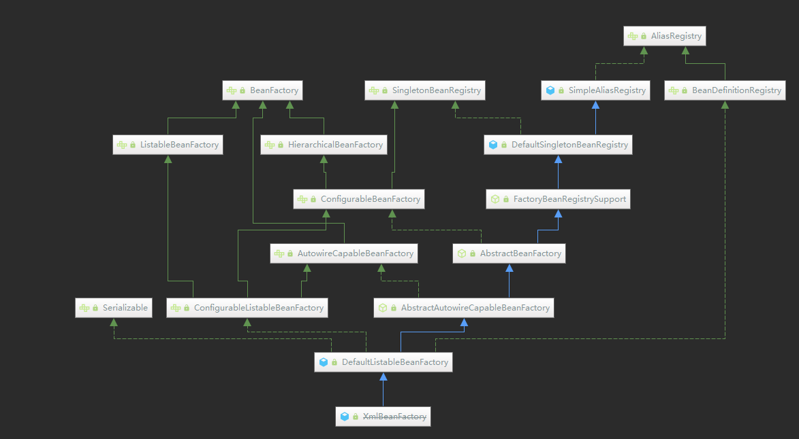
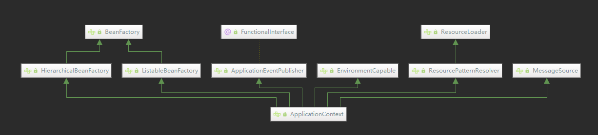

# Spring 常用接口

## Bean 工厂相关

### BeanFactory

这个接口是访问Spring bean 容器的顶层接口。实现类会持有一些bean定义，每一个都有唯一的名称。根据bean定义，这个工厂将返回一个独立的（原型设计模式），或者是一个共享的实例(单例模式的强力替代品，实例在工厂的生存周期内是一个单例),返回的实例类型取决于工厂配置。

这种方式的要点是BeanFactory是应用程序组件的注册中心，并集中配置应用的组件(例如，单个对象不再需要读取配置文件)。

#### ListableBeanFactory

继承自`BeanFactory`, 这个接口的用途是枚举所有bean 实例，而不是客户端通过名称一个个查找。

#### HierarchicalBeanFactory

这个接口用来实现工厂的继承关系，

#### AutowireCapableBeanFactory

此工厂提供bean自动注入功能。

#### ConfigurableBeanFactory

提供配置bean工厂的功能，但是此工厂一般是框架内部使用。

#### ConfigurableListableBeanFactory

提供分析和修改bean定义和预初始化单例bean的功能。

### ConversionService

用于类型转换的服务接口。这是转换系统的入口点。调用`convert(Object, Class)`方法来使用此系统执行线程安全类型转换

### AliasRegistry

用来注册别名的顶层接口

#### BeanDefinitionRegistry

用来注册bean 定义

### FactoryBean

接口由BeanFactory中的对象实现，这些对象本身是用于单个对象的工厂。如果一个bean实现了这个接口，那么它将被用作要公开的对象的工厂，而不是将自己公开的bean实例。

**注意:实现此接口的bean不能作为普通bean使用。FactoryBean是以bean形式定义的，但是bean引用公开的对象(`getObject()`)总是它创建的对象。**

`FactoryBean`s可以支持单例和原型，可以根据需要创建对象，也可以在启动时创建对象。`SmartFactoryBean`接口允许公开更细粒度的行为元数据。

这个接口在框架本身中大量使用，例如在AOP `org.springframework.aop.framework.ProxyFactoryBean`或`org.springframework.jndi.JndiObjectFactoryBean`中。它也可以用于定制组件; 然而，这只在基础组件代码中很常见。
`FactoryBean`是一个编程契约。实现不应该依赖于`annotation-driven`注入或其他反射工具。可能会在启动过程中提前调用`getObjectType()` 和`getObject()`，甚至比任何后处理器设置都要早。如果需要访问其他bean，请实现`BeanFactoryAware`并通过编写代码获取。

最后，`FactoryBean`对象参与bean工厂的bean创建同步过程。通常不需要内部同步，只需要在`FactoryBean`本身(或类似的东西)中进行延迟初始化即可

### SmartFactoryBean

`FactoryBean`接口的扩展。当`isSingleton()`实现返回`false`而没有明确表示独立实例时，实现类可能会指示它们是否总是返回独立实例。

如果它们的`isSingleton()`实现返回false，那么不实现这个扩展接口的纯`FactoryBean`实现类将始终返回独立实例;只有在需要时才访问公开的对象。

**注意:这个接口是一个特殊用途的接口，主要用于框架内部和协作框架内部。通常，应用程序提供的`FactoryBean`应该简单地实现普通的`FactoryBean`接口。新的方法可能会被添加到这个扩展的接口中.**

### BeanNameGenerator

用于为bean定义生成bean名称的策略接口

### BeanFactoryPostProcessor

允许自定义修改应用程序上下文的bean定义，调整上下文的底层bean工厂的bean属性值。

应用程序上下文可以自动检测bean定义中的`BeanFactoryPostProcessor` bean，并在创建任何其他bean之前应用它们。

系统管理员使用自定义配置文件覆盖在应用程序上下文中配置的bean属性非常有用。

有关解决此类配置需求的开箱即用解决方案，请参见`PropertyResourceConfigurer`及其具体实现。

`BeanFactoryPostProcessor`可以与bean定义交互并修改bean定义，但不能与bean实例交互。这样做可能会导致过早的bean实例化，破坏容器并导致意想不到的副作用。如果需要与bean实例交互，可以考虑实现`BeanPostProcessor`。

#### BeanDefinitionRegistryPostProcessor

扩展标准的`BeanFactoryPostProcessor` SPI，允许在常规的`BeanFactoryPostProcessor`检测开始之前注册更多的bean定义。特别是，`BeanDefinitionRegistryPostProcessor`可以注册更多的bean定义，这些bean定义又定义`BeanFactoryPostProcessor`实例。

### BeanPostProcessor

工厂允许自定义修改新的bean实例的入口，例如检查标记接口或用代理包装它们。

`ApplicationContext`可以自动检测bean定义中的`BeanPostProcessor` bean，并将它们应用于随后创建的任何bean。普通bean工厂允许编程式注册后处理程序，适用于通过该工厂创建的所有bean。

通常，通过标记接口或类似方法填充bean的后处理程序将实现`postProcessBeforeInitialization`方法，而使用代理包装bean的后处理器通常实现`postProcessAfterInitialization`方法.

### ImportSelector

根据给定的选择标准(通常是一个或多个注解属性)确定应该导入哪个`@Configuration`类。
`ImportSelector`可以实现以下任何一个感知接口，它们各自的方法将在`selectImports`之前被调用:

- `EnvironmentAware`
- `BeanFactoryAware`
- `BeanClassLoaderAware`
- `ResourceLoaderAware`
`ImportSelector`通常以与常规`@Import`注解相同的方式处理，但是，也可以推迟选择导入，直到处理完所有`@Configuration`类(有关详细信息，请参阅`DeferredImportSelector`)

#### DeferredImportSelector

`ImportSelector`的一个变体，它在处理完所有`@Configuration` bean之后运行。当选择的导入是`@Conditional`时，这种类型的选择器特别有用。
实现类还可以扩展`org.springframework.core.Ordered`接口或使用`org.springframework.core.annotation.Order`注解，指示相对于其他`DeferredImportSelector`的优先级。

实现类还可以提供一个导入组（`getImportGroup()`），该导入组可以跨不同的选择器提供额外的排序和过滤逻辑.

### ImportBeanDefinitionRegistrar

可以用来在处理`@Configuration`类时注册其他bean定义。在bean定义级别(与`@Bean`方法/实例级别相反)操作是需要的或必要的。
与`@Configuration`和`ImportSelector`一起，可以向`@Import`注解提供这种类型的类(或者也可以从`ImportSelector`返回)。
`ImportBeanDefinitionRegistrar`可以实现以下任何一个可感知的接口，它们各自的方法将在`registerBeanDefinitions`之前被调用:

- `EnvironmentAware`
- `BeanFactoryAware`
- `BeanClassLoaderAware`
- `ResourceLoaderAware`

## 应用上下文相关

### ApplicationContext

此接口用来为应用程序提供配置。在应用运行过程中，配置应该是只读的，但是可以根据实现类来实现重新加载。

`ApplicationContext` 提供：

- 访问应用组件的工厂方法，从`ListableBeanFactory` 接口继承而来。
- 通用的方式加载资源文件，从`ResourceLoader`接口继承而来。
- 向注册的监听器发布事件。从`ApplicationEventPublisher`接口继承而来。
- 转换消息，并支持国际化，从`MessageSource`接口继承而来。
- 继承父级上下文能力。后代上下文中的定义将保持优先。这意味着，比如说一个父上下文可以被整个web应用访问，然而每个servlet有它自己的子类上下文，这个上下文是和别的servlet隔离的。

#### ConfigurableApplicationContext

此接口提供配置应用上下文的方法

### AttributeAccessor

该接口定义用于向任意对象设置和访问元数据的通用协议。

#### BeanDefinition

bean定义描述了一个bean实例的属性值、构造函数参数值和由具体实现提供的进一步信息。
这只是一个最小的接口:主要目的是允许`BeanFactoryPostProcessor`(如`PropertyPlaceholderConfigurer`)反省和修改属性值和bean其他的元数据

#### AnnotatedBeanDefinition

bean定义的扩展接口，它暴露`AnnotationMetadata`的bean 类型——而不需要加载该类。

## 类型元数据相关

### ClassMetadata

该接口定义特定类的抽象元数据，不需要加载该类。

### AnnotatedTypeMetadata

定义对特定类型(类`AnnotationMetadata`或方法`MethodMetadata`)的注解的访问，其方式不一定需要加载类

### AnnotationMetadata

定义访问特定类型注解的方式

### MethodMetadata

### MetadataReader

用于访问类元数据的简单门面，由ASM`org.springframework.asm.ClassReader`类实现

### ResourceLoader

加载资源的策略接口(例如类路径或文件系统资源)。`org.springframework.context.ApplicationContext`需要提供此功能，以及扩展`org.springframework.core.io.support.ResourcePatternResolver`支持。

`DefaultResourceLoader`是一个独立的实现，可以在`ApplicationContext`之外使用，也可以由`ResourceEditor`使用。

当在`ApplicationContext`中使用时，可以使用特定上下文的资源加载策略从字符串填充Resource类型和Resource数组的Bean属性

#### ResourcePatternResolver

用于将位置模式(例如，ant样式的路径模式)解析为资源对象的策略接口。

这是`ResourceLoader`接口的扩展。可以检查传入的ResourceLoader(比如在容器中运行时，通过`org.springframework.context.ResourceLoaderAware`)是否也实现了这个扩展接口。

`PathMatchingResourcePatternResolver`是一个独立的实现，可以在`ApplicationContext`之外使用，`ResourceArrayPropertyEditor`也使用它来填充bean的资源数组属性。

可以与任何类型的位置模式(例如`/WEB-INF/*-context.xml`):输入模式必须匹配策略实现。这个接口只指定转换方法，而不是特定的模式格式。

这个接口还为类路径中所有匹配的资源提供了一个新的资源前缀`classpath*:`。注意，在这种情况下，资源位置应该是一个没有占位符的路径(例如`/beans.xml`); JAR文件或类目录可以包含多个同名文件

### MessageSource

用于解析消息的策略接口，支持此类消息的参数化和国际化。
Spring为生产提供了两种开箱即用的实现:

- `org.springframework.context.support.ResourceBundleMessageSource`, 基于`java.util.ResourceBundle`
- `org.springframework.context.support.ReloadableResourceBundleMessageSource` , 不重启的情况下重新加载消息定义

#### HierarchicalMessageSource

继承自`MessageSource`, 体现层次结构

### ApplicationEventPublisher

封装事件发布功能。作为`ApplicationContext`的顶级接口

### EnvironmentCapable

此接口标志着组件包含和暴露`Environment`引用。

所有Spring应用程序上下文都是`EnvironmentCapable`，并且该接口主要用于在框架方法中执行`instanceof`检查，这些框架方法接受`BeanFactory`实例(这些实例可能是，也可能不是实际的`ApplicationContext`实例)，以便在环境确实可用时与环境进行交互。

如前所述，`ApplicationContext`扩展了`EnvironmentCapable`，从而公开了`getEnvironment()`方法; 然而，`ConfigurableApplicationContext`重新定义了`getEnvironment()`，并缩小了方法签名的范围，返回一个`ConfigurableEnvironment`。其结果是，在从`ConfigurableApplicationContext`访问环境对象之前，`Environment`对象是“只读的”，此时也可以配置它

### PropertyResolver

此接口用于根据任何来源解析属性。

#### Environment

此接口表示当前应用程序运行所在的环境。对应用程序环境的两个关键方面建模:`profiles`和`properties`。与属性访问相关的方法通过`PropertyResolver`父接口公开。

`profile`是一个命名的bean定义逻辑组，只有在给定`profile`处于`active`状态时才向容器注册。可以将bean分配给一个`profile`，无论是在XML中定义的还是通过注解定义的; 有关语法细节，请参阅spring-beans 3.1 schema 或`@Profile`注解。与 profiles 相关的`Environment`对象的角色是确定哪些profiles(如果有的话)当前(`getActiveProfiles`)是`active`的，以及哪些profiles (如果有的话)在默认情况(`getDefaultProfiles`)下应该是`active`的。

`Properties`几乎在所有的应用程序中都扮演着重要的角色，并且可能来自各种各样的源:属性文件、JVM系统属性、系统环境变量、JNDI、servlet上下文参数、特殊属性对象、Maps 等等。`Environment`对象与`Properties`之间的关系的作用是为用户提供一个方便的服务接口，用于配置`Properties`源并从中解析`Properties`。

在`ApplicationContext`中管理的bean可以注册为`EnvironmentAware` bean或`@Inject` `Environment`bean，以便直接查询`profile`状态或解析属性。

然而，在大多数情况下，应用级bean不需要直接与`Environment`交互，而是必须使用`${…}`属性值替换为属性占位符配置程序，如`PropertySourcesPlaceholderConfigurer`，它本身是`EnvironmentAware`的，从Spring 3.1开始，默认情况下使用`<context:property-placeholder/>`注册。

`environment`对象的配置必须通过`ConfigurableEnvironment`接口完成，该接口由所有`AbstractApplicationContext`子类的`getEnvironment()`方法返回。有关在应用程序上下文`refresh()`之前操作属性源的使用示例，请参阅`ConfigurableEnvironment` Javadoc。

#### ConfigurableEnvironment

此接口提供设置`active`和`default`配置文件以及操作基础属性源的工具。允许客户端通过`ConfigurablePropertyResolver` 父接口设置和验证所需的属性、定制转换服务等等。

#### ConfigurablePropertyResolver

此接口提供访问的工具和自定义转换属性值时使用的`ConversionService`。

## xml 解析与BeanDefinition 解析相关

### NamespaceHandler

`DefaultBeanDefinitionDocumentReader`使用的基本接口，用于处理Spring XML配置文件中的自定义名称空间。

实现类将返回用于自定义顶级标签的`BeanDefinitionParser`接口的实现，以及用于自定义嵌套标签的`BeanDefinitionDecorator`接口的实现。

解析器将在遇到`<beans>`标签下的自定义标签时调用`parse`方法，并在遇到`<bean>`标签下的自定义标签时进行调用`decorate`方法。

编写自己的自定义元素扩展时通常不需要直接实现这个接口，而是使用提供的`NamespaceHandlerSupport`类

### NamespaceHandlerResolver

`DefaultBeanDefinitionDocumentReader`用这个接口为特定名称空间URI定位`NamespaceHandler`实现类

### BeanDefinitionParser

`DefaultBeanDefinitionDocumentReader`用来处理自定义顶级(直接位于`<beans/>`下)标签的接口。

实现类可以根据需要自由地将自定义标记中的元数据转换成任意多的`BeanDefinition`。

解析器从相关联的`NamespaceHandler`中为自定义标记所在的命名空间定位一个`BeanDefinitionParser`

### BeanDefinitionDecorator

`DefaultBeanDefinitionDocumentReader`使用该接口来处理自定义的嵌套(直接位于`<bean>`下)标签。

还可以用于装饰`<bean>`标签的自定义属性。实现类可以自由地将自定义标签中的元数据转换为所需的任意多个`BeanDefinition`，并转换包含的`<bean>`标签为`BeanDefinition`，甚至可能返回一个完全不同的`BeanDefinition`来替换原来的。

`BeanDefinitionDecorator`应该感知到它们可能是解析链的一部分。特别是，`BeanDefinitionDecorator`应该感知到之前的`BeanDefinitionDecorator`可能已经用`org.springframework.aop.framework.ProxyFactoryBean`定义替换了原来的`org.springframework.bean.factory.config.BeanDefinition`，它允许添加自定义拦截器。

希望向所包含的bean添加拦截器的`BeanDefinitionDecorator`应该扩展`org.springframework.aop.config.AbstractInterceptorDrivenBeanDefinitionDecorator`，它处理解析链，确保只创建一个代理，并且它包含链中的所有拦截器。

解析器从`NamespaceHandler`中为自定义标签所在的命名空间定位一个`BeanDefinitionDecorator`。

### MergedBeanDefinitionPostProcessor

用于在运行时`合并`bean定义的后处理器回调接口。为了后处理Spring `BeanFactory`用来创建bean实例的合并bean定义(原始bean定义的已处理副本)，BeanPostProcessor实现可以实现这个子接口。

例如，`postProcessMergedBeanDefinition`方法可以内省bean定义，以便在对bean的实际实例进行后处理之前准备一些缓存的元数据。它还允许修改bean定义，但是`只`允许修改实际上用于并发修改的定义属性。本质上，这只适用于在`RootBeanDefinition`本身上定义的操作，而不适用于其基类的属性

### BeanDefinitionReader

bean定义阅读器的简单接口。定义带有`Resource`和`String`位置参数的加载方法。

当然具体的bean定义阅读器可以为bean定义添加额外的加载和注册方法，具体到它们的bean定义格式。

请注意，bean定义阅读器不必实现此接口。它仅为希望遵循标准命名约定的bean定义读者提供建议。

### BeanDefinitionDocumentReader

用于解析包含Spring bean定义的XML文档的SPI。`XmlBeanDefinitionReader`用于实际解析DOM文档。

要解析的每个文档实例化:实现类可以在`registerBeanDefinitions`方法执行期间在实例变量中保存状态——例如，为文档中所有bean定义定义的全局设置

### DestructionAwareBeanPostProcessor

### InstantiationAwareBeanPostProcessor

### SmartInstantiationAwareBeanPostProcessor

## 标记接口相关

### Aware

#### BeanFactoryAware

#### ApplicationEventPublisherAware

#### NotificationPublisherAware

#### MessageSourceAware

#### EnvironmentAware

#### EmbeddedValueResolverAware

#### ResourceLoaderAware

#### ImportAware

#### LoadTimeWeaverAware

#### BeanNameAware

#### BeanClassLoaderAware

#### ApplicationContextAware